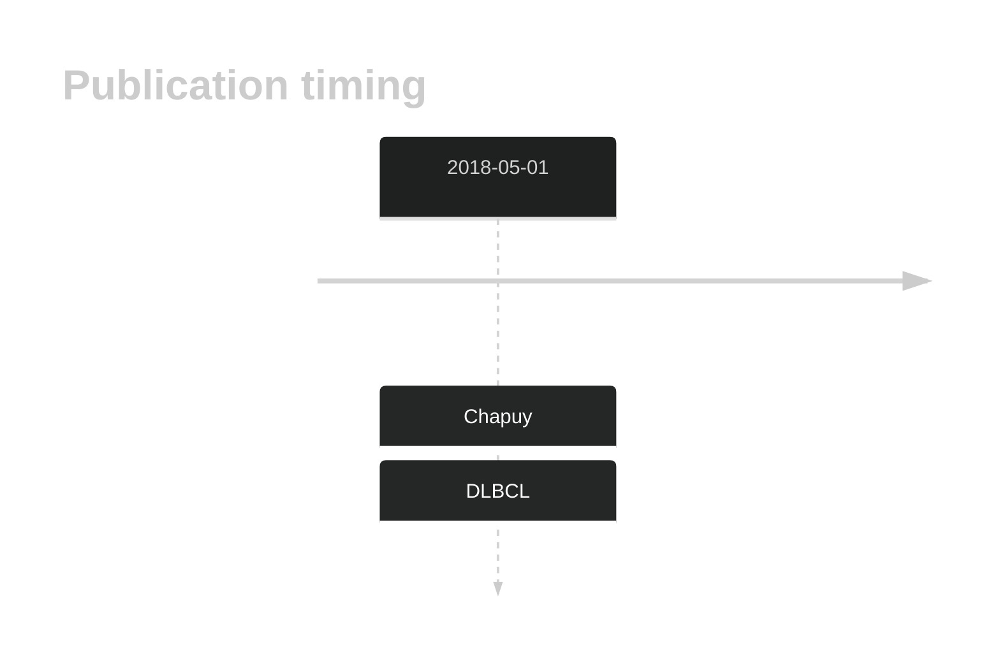

# DOCK1

## History

## Relevance tier by entity

|Entity|Tier|Description                              |
|:------:|:----:|-----------------------------------------|
| |2   |relevance in DLBCL not firmly established[@chapuyMolecularSubtypesDiffuse2018b]|

## Mutation incidence in large patient cohorts (GAMBL reanalysis)

|Entity|source        |frequency (%)|
|:------:|:--------------:|:-------------:|
|DLBCL |GAMBL genomes | 3.82        |
|DLBCL |Schmitz cohort|10.21        |
|DLBCL |Reddy cohort  | 4.90        |
|DLBCL |Chapuy cohort | 5.98        |

## Mutation pattern and selective pressure estimates

|Entity|aSHM|Significant selection|dN/dS (missense)|dN/dS (nonsense)|
|:------:|:----:|:---------------------:|:----------------:|:----------------:|
|BL    |No  |No                   |0.528           |0               |
|DLBCL |No  |No                   |1.001           |0               |
|FL    |No  |No                   |1.838           |0               |

View coding variants in ProteinPaint [hg19](https://morinlab.github.io/LLMPP/GAMBL/DOCK1_protein.html)  or [hg38](https://morinlab.github.io/LLMPP/GAMBL/DOCK1_protein_hg38.html)

View all variants in GenomePaint [hg19](https://morinlab.github.io/LLMPP/GAMBL/DOCK1.html)  or [hg38](https://morinlab.github.io/LLMPP/GAMBL/DOCK1_hg38.html)

## DOCK1 Expression

<!-- ORIGIN: chapuyMolecularSubtypesDiffuse2018b -->
<!-- DLBCL: chapuyMolecularSubtypesDiffuse2018b -->

## References

