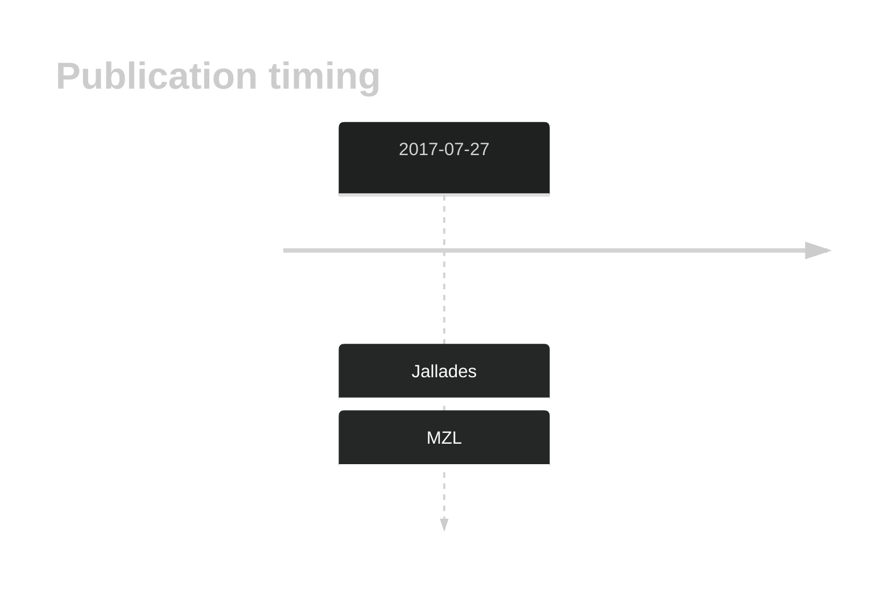

# DOCK6

## History

## Relevance tier by entity

|Entity|Tier|Description|
|:------:|:----:|--------------------------------------|
||2|relevance in MZL not firmly established[@jalladesExomeSequencingIdentifies2017]|

## Mutation incidence in large patient cohorts (GAMBL reanalysis)

|Entity|source |frequency (%)|
|:------:|:----:|:----:|
|BL|GAMBL Exome |9.77 |
|BL|GAMBL Genome |3.475 |
|DLBCL|GAMBL Exome |3.504 |
|DLBCL|GAMBL Genome |2.068 |
|FL|GAMBL Exome |0.86 |
|MCL|GAMBL Genome |1.754 |

## References

