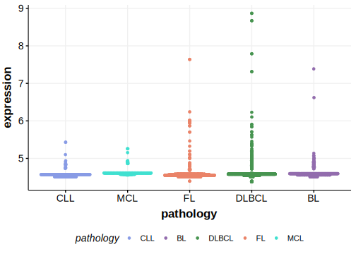

[[_TOC_]]

## Relevance tier by entity

[[include:tables/table1_DSG4.md]]

## Mutation incidence in large patient cohorts (GAMBL reanalysis)

|Entity|source        |frequency (%)|
|:------:|:--------------:|:-------------:|
|DLBCL |GAMBL genomes |3.06         |
|DLBCL |Schmitz cohort|5.32         |
|DLBCL |Reddy cohort  |2.40         |
|DLBCL |Chapuy cohort |5.13         |

## Mutation pattern and selective pressure estimates

[[include:tables/dnds_DSG4.md]]

[[include:tables/browser_DSG4.md]]

## Expression

<!-- ORIGIN: morinMutationalStructuralAnalysis2013 -->
<!-- DLBCL: morinMutationalStructuralAnalysis2013 -->

## All Mutations

[RG028](https://www.bcgsc.ca/downloads/morinlab/GAMBL/Morin_2013/RG028.html)
[RG049](https://www.bcgsc.ca/downloads/morinlab/GAMBL/Morin_2013/RG049.html)
[RG054](https://www.bcgsc.ca/downloads/morinlab/GAMBL/Morin_2013/RG054.html)
[RG067](https://www.bcgsc.ca/downloads/morinlab/GAMBL/Morin_2013/RG067.html)

[[include:tables/mermaid_DSG4.md]]

## References

