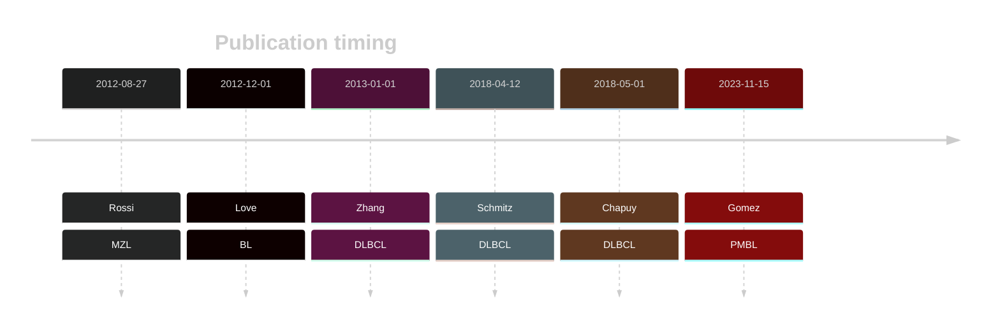
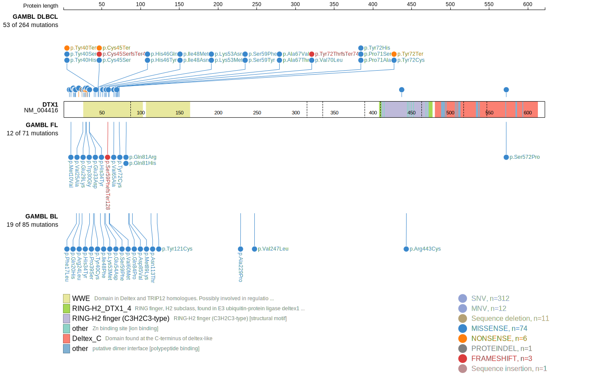
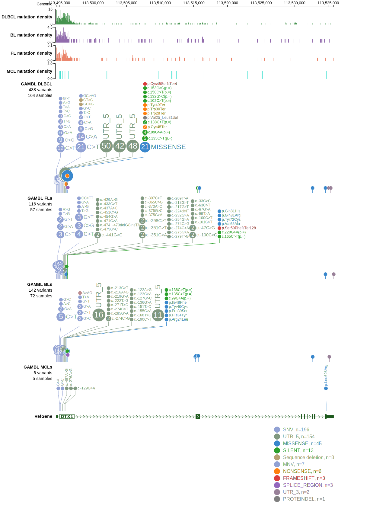
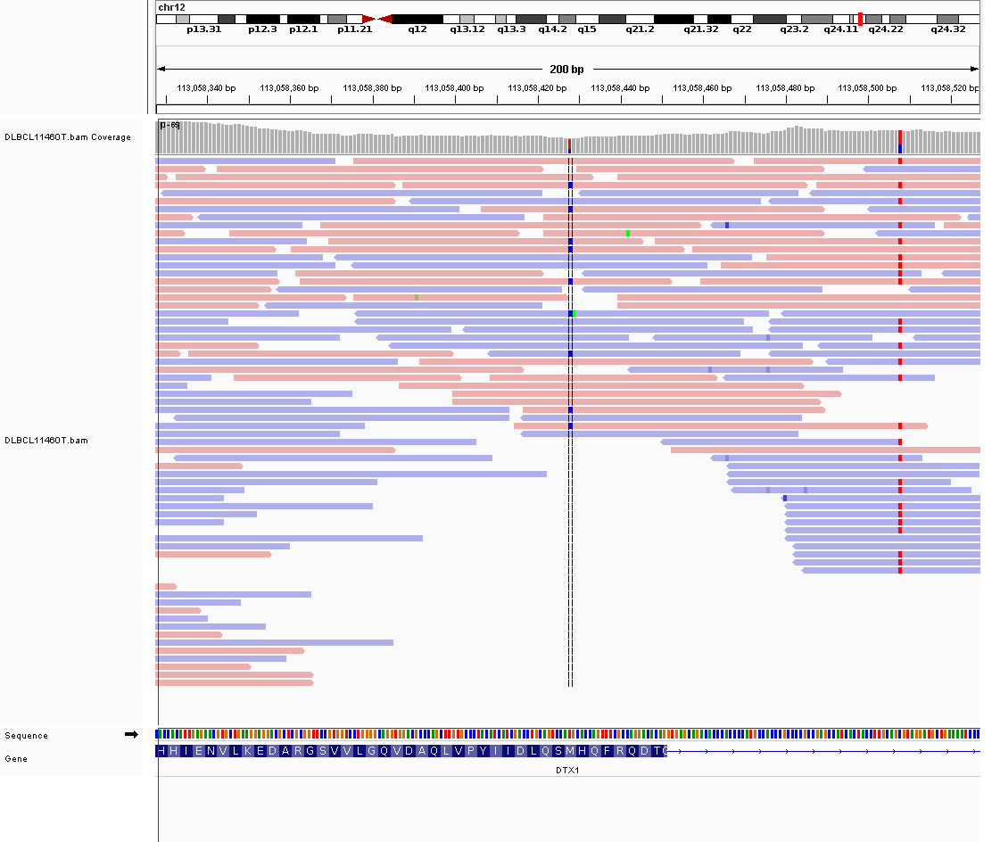

# DTX1

## Overview
Mutations in the DTX1 gene, which encodes the E3 ubiquitin ligase Deltex 1, have been identified in various B-cell lymphomas, including diffuse large B-cell lymphoma (DLBCL). DTX1 is one of [a number of genes](https://github.com/morinlab/LLMPP/wiki/ashm) affected by aberrant somatic hypermutation in B-cell lymphomas, which complicates the interpretation of mutations at this locus. These mutations are associated with the BN2 genetic subgroup of DLBCL. There are numerous mutation hotspots in this gene with some leading to a truncated protein. DTX1 functions as a negative regulator of the Notch signaling pathway. Some DTX1 mutations impair its function, thereby dysregulating Notch signaling, which is crucial for normal B-cell development and function.  *Due to [minimal support](DLGAP1#representative-mutation) in the original primary data and very few mutations reported in subsequent BL studies, this gene is very unlikely to be relevant in BL.* 

## History

## Relevance tier by entity

|Entity|Tier|Description                           |
|:------:|:----:|--------------------------------------|
||1|high-confidence PMBL/cHL/GZL gene[@gomezUltraDeepSequencingReveals2023]|
||1|high-confidence MZL gene[@rossiCodingGenomeSplenic2012]|
|    |3 | Retired, Failed QC[@loveGeneticLandscapeMutations2012]|
| |1 | aSHM target and high-confidence DLBCL gene            [@zhangGeneticHeterogeneityDiffuse2013; @schmitzGeneticsPathogenesisDiffuse2018; @chapuyMolecularSubtypesDiffuse2018]|
|    |1 | aSHM target and high-confidence FL gene               |

## Mutation incidence in large patient cohorts (GAMBL reanalysis)

|Entity|source               |frequency (%)|
|:------:|:---------------------:|:-------------:|
|DLBCL |GAMBL genomes        |10.71        |
|DLBCL |Schmitz cohort       |13.62        |
|DLBCL |Reddy cohort         | 5.91        |
|DLBCL |Chapuy cohort        |11.54        |
|FL    |GAMBL genomes        | 5.54        |
|BL    |GAMBL genomes+capture| 5.54        |
|BL    |Thomas cohort        | 5.90        |
|BL    |Panea cohort         | 8.90        |

## Mutation pattern and selective pressure estimates

|Entity|aSHM|Significant selection|dN/dS (missense)|dN/dS (nonsense)|
|:------:|:----:|:---------------------:|:----------------:|:----------------:|
|DLBCL |Yes |Yes                  |2.228           | 4.244          |
|FL    |Yes |No                   |6.305           | 0.000          |
|BL    |Yes |No                   |5.556           |14.253          |

## aSHM regions

|chr_name|hg19_start|hg19_end |region                                                                                      |regulatory_comment|
|:--------:|:----------:|:---------:|:--------------------------------------------------------------------------------------------:|:------------------:|
|chr12   |113492311 |113497546|[TSS](https://genome.ucsc.edu/s/rdmorin/GAMBL%20hg19?position=chr12%3A113492311%2D113497546)|NA                |

## DTX1 Hotspots

| Chromosome |Coordinate (hg19) | ref>alt | HGVSp | 
 | :---:| :---: | :--: | :---: |
| chr12 | 113496076 | G>A | V27M |
| chr12 | 113496081 | G>A | W28* |
| chr12 | 113496082 | G>A | E29K |
| chr12 | 113496083 | A>G | E29G |
| chr12 | 113496085 | T>G | W30G |
| chr12 | 113496087 | G>A | W30* |
| chr12 | 113496089 | T>A | L31Q |
| chr12 | 113496089 | T>C | L31P |
| chr12 | 113496096 | G>C | E33D |
| chr12 | 113496097 | C>T | H34Y |
| chr12 | 113496112 | C>T | P39S |
| chr12 | 113496115 | T>C | Y40H |
| chr12 | 113496116 | A>C | Y40S |
| chr12 | 113496116 | A>G | Y40C |
| chr12 | 113496117 | C>G | Y40* |
| chr12 | 113496121 | G>C | A42P |
| chr12 | 113496130 | T>A | C45S |
| chr12 | 113496132 | C>A | C45* |
| chr12 | 113496133 | C>T | H46Y |
| chr12 | 113496135 | C>A | H46Q |
| chr12 | 113496139 | A>T | I48F |
| chr12 | 113496140 | T>A | I48N |
| chr12 | 113496141 | T>G | I48M |
| chr12 | 113496148 | G>A | V51M |
| chr12 | 113496155 | A>T | K53M |
| chr12 | 113496156 | G>C | K53N |
| chr12 | 113496159 | G>C | E54D |
| chr12 | 113496162 | CG>AA | DA55ET |
| chr12 | 113496170 | G>A | G58D |
| chr12 | 113496173 | C>A | S59Y |
| chr12 | 113496173 | C>T | S59F |
| chr12 | 113496175 | G>A | V60M |
| chr12 | 113496191 | T>C | V65A |
| chr12 | 113496191 | T>G | V65G |
| chr12 | 113496196 | G>A | A67T |
| chr12 | 113496197 | C>T | A67V |
| chr12 | 113496201 | G>C | Q68H |
| chr12 | 113496202 | C>T | L69F |
| chr12 | 113496205 | G>C | V70L |
| chr12 | 113496208 | C>G | P71A |
| chr12 | 113496208 | C>T | P71S |
| chr12 | 113496210 | CT>TC | Y72H |
| chr12 | 113496212 | A>G | Y72C |
| chr12 | 113496213 | C>A | Y72* |

View coding variants in ProteinPaint [hg19](https://morinlab.github.io/LLMPP/GAMBL/DTX1_protein.html)  or [hg38](https://morinlab.github.io/LLMPP/GAMBL/DTX1_protein_hg38.html)

View all variants in GenomePaint [hg19](https://morinlab.github.io/LLMPP/GAMBL/DTX1.html)  or [hg38](https://morinlab.github.io/LLMPP/GAMBL/DTX1_hg38.html)

## DTX1 Expression

## Representative Mutations

### BL[@loveGeneticLandscapeMutations2012]

**Rating**
&starf; &star; &star; &star; &star;

## DLBCL[@schmitzGeneticsPathogenesisDiffuse2018a]

**Rating**
&starf; &starf; &starf; &starf; &star;

## All Mutations

### BL

[1059](https://www.bcgsc.ca/downloads/morinlab/GAMBL/Love/1059_reports.html)
[323](https://www.bcgsc.ca/downloads/morinlab/GAMBL/Love/323_reports.html)
[742](https://www.bcgsc.ca/downloads/morinlab/GAMBL/Love/742_reports.html)

## References

<!-- BL: paneaWholeGenomeLandscape2019 -->
<!-- BL: paneaWholeGenomeLandscape2019 -->
<!-- DLBCL: schmitzGeneticsPathogenesisDiffuse2018a -->
<!-- MZL: rossiCodingGenomeSplenic2012c -->
<!-- PMBL: gomezUltraDeepSequencingReveals2023 -->
