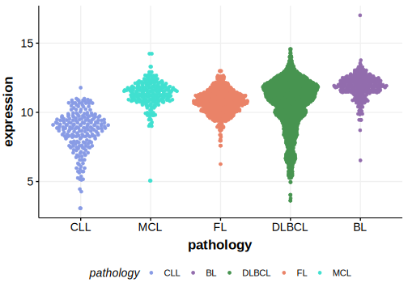

# DTX1
## Overview
Mutations in the DTX1 gene, which encodes the E3 ubiquitin ligase Deltex 1, have been identified in various B-cell lymphomas, including diffuse large B-cell lymphoma (DLBCL). DTX1 is one of [a number of genes](https://github.com/morinlab/LLMPP/wiki/ashm) affected by aberrant somatic hypermutation in B-cell lymphomas, which complicates the interpretation of mutations at this locus. These mutations are associated with the BN2 genetic subgroup of DLBCL.1 There are numerous mutation hotspots in this gene with some leading to a truncated protein. DTX1 functions as a negative regulator of the Notch signaling pathway. Some DTX1 mutations impair its function, thereby dysregulating Notch signaling, which is crucial for normal B-cell development and function. 2 

## Relevance tier by entity

|Entity|Tier|Description                           |
|:------:|:----:|--------------------------------------|
|BL    |2-a | aSHM target; Although recurrent, the relevance of mutations in BL is tenuous |
|DLBCL |1-a | aSHM target and high-confidence DLBCL gene            |
|FL    |1-a | aSHM target and high-confidence FL gene               |

## Mutation incidence in large patient cohorts (GAMBL reanalysis)

|Entity|source               |frequency (%)|
|:------:|:---------------------:|:-------------:|
|DLBCL |GAMBL genomes        |10.71        |
|DLBCL |Schmitz cohort       |13.62        |
|DLBCL |Reddy cohort         | 5.91        |
|DLBCL |Chapuy cohort        |11.54        |
|FL    |GAMBL genomes        | 5.54        |
|BL    |GAMBL genomes+capture| 5.54        |
|BL    |Thomas cohort        | 5.90        |
|BL    |Panea cohort         | 8.90        |

## Mutation pattern and selective pressure estimates

|Entity|aSHM|Significant selection|dN/dS (missense)|dN/dS (nonsense)|
|:------:|:----:|:---------------------:|:----------------:|:----------------:|
|DLBCL |Yes |Yes                  |2.228           | 4.244          |
|FL    |Yes |No                   |6.305           | 0.000          |
|BL    |Yes |No                   |5.556           |14.253          |

## aSHM regions

|chr_name|hg19_start|hg19_end |region                                                                                      |regulatory_comment|
|:--------:|:----------:|:---------:|:--------------------------------------------------------------------------------------------:|:------------------:|
|chr12   |113492311 |113497546|[TSS](https://genome.ucsc.edu/s/rdmorin/GAMBL%20hg19?position=chr12%3A113492311%2D113497546)|NA                |

> [!NOTE]
> First described in DLBCL in 2014.2 and in BL in 2019 by [Panea RI](https://pubmed.ncbi.nlm.nih.gov/31558468). 

 ## DTX1 Hotspots

| Chromosome |Coordinate (hg19) | ref>alt | HGVSp | 
 | :---:| :---: | :--: | :---: |
| chr12 | 113496076 | G>A | V27M |
| chr12 | 113496081 | G>A | W28* |
| chr12 | 113496082 | G>A | E29K |
| chr12 | 113496083 | A>G | E29G |
| chr12 | 113496085 | T>G | W30G |
| chr12 | 113496087 | G>A | W30* |
| chr12 | 113496089 | T>A | L31Q |
| chr12 | 113496089 | T>C | L31P |
| chr12 | 113496096 | G>C | E33D |
| chr12 | 113496097 | C>T | H34Y |
| chr12 | 113496112 | C>T | P39S |
| chr12 | 113496115 | T>C | Y40H |
| chr12 | 113496116 | A>C | Y40S |
| chr12 | 113496116 | A>G | Y40C |
| chr12 | 113496117 | C>G | Y40* |
| chr12 | 113496121 | G>C | A42P |
| chr12 | 113496130 | T>A | C45S |
| chr12 | 113496132 | C>A | C45* |
| chr12 | 113496133 | C>T | H46Y |
| chr12 | 113496135 | C>A | H46Q |
| chr12 | 113496139 | A>T | I48F |
| chr12 | 113496140 | T>A | I48N |
| chr12 | 113496141 | T>G | I48M |
| chr12 | 113496148 | G>A | V51M |
| chr12 | 113496155 | A>T | K53M |
| chr12 | 113496156 | G>C | K53N |
| chr12 | 113496159 | G>C | E54D |
| chr12 | 113496162 | CG>AA | DA55ET |
| chr12 | 113496170 | G>A | G58D |
| chr12 | 113496173 | C>A | S59Y |
| chr12 | 113496173 | C>T | S59F |
| chr12 | 113496175 | G>A | V60M |
| chr12 | 113496191 | T>C | V65A |
| chr12 | 113496191 | T>G | V65G |
| chr12 | 113496196 | G>A | A67T |
| chr12 | 113496197 | C>T | A67V |
| chr12 | 113496201 | G>C | Q68H |
| chr12 | 113496202 | C>T | L69F |
| chr12 | 113496205 | G>C | V70L |
| chr12 | 113496208 | C>G | P71A |
| chr12 | 113496208 | C>T | P71S |
| chr12 | 113496210 | CT>TC | Y72H |
| chr12 | 113496212 | A>G | Y72C |
| chr12 | 113496213 | C>A | Y72* |

View coding variants in ProteinPaint [hg19](https://morinlab.github.io/LLMPP/GAMBL/DTX1_protein.html)  or [hg38](https://morinlab.github.io/LLMPP/GAMBL/DTX1_protein_hg38.html)

View all variants in GenomePaint [hg19](https://morinlab.github.io/LLMPP/GAMBL/DTX1.html)  or [hg38](https://morinlab.github.io/LLMPP/GAMBL/DTX1_hg38.html)

## References
1. *Wright GW, Huang DW, Phelan JD, Coulibaly ZA, Roulland S, Young RM, Wang JQ, Schmitz R, Morin RD, Tang J, Jiang A, Bagaev A, Plotnikova O, Kotlov N, Johnson CA, Wilson WH, Scott DW, Staudt LM. A Probabilistic Classification Tool for Genetic Subtypes of Diffuse Large B Cell Lymphoma with Therapeutic Implications. Cancer Cell. 2020 Apr 13;37(4):551-568.e14. doi: 10.1016/j.ccell.2020.03.015. PMID: 32289277; PMCID: PMC8459709.*
2. *de Miranda NF, Georgiou K, Chen L, Wu C, Gao Z, Zaravinos A, Lisboa S, Enblad G, Teixeira MR, Zeng Y, Peng R, Pan-Hammarström Q. Exome sequencing reveals novel mutation targets in diffuse large B-cell lymphomas derived from Chinese patients. Blood. 2014 Oct 16;124(16):2544-53. doi: 10.1182/blood-2013-12-546309. Epub 2014 Aug 29. PMID: 25171927; PMCID: PMC4199956.*## DTX1 Expression

<!-- ORIGIN: schmitzGeneticsPathogenesisDiffuse2018a -->
