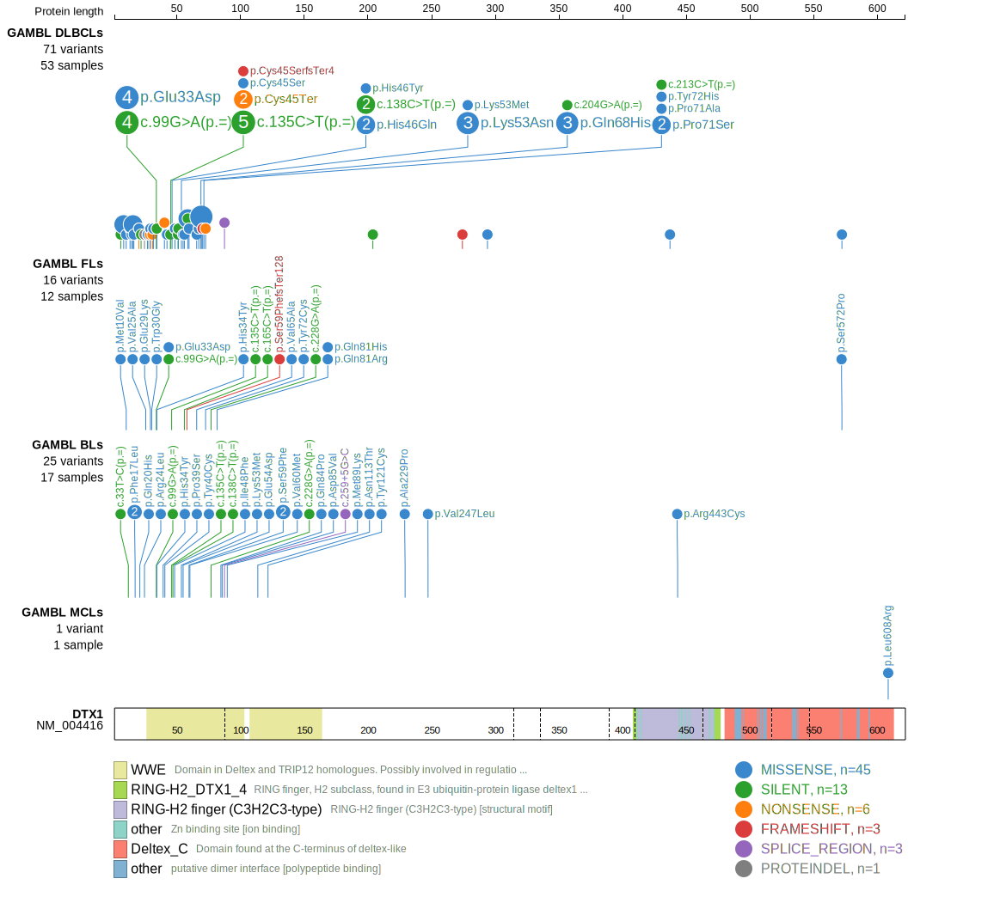

DTX1 is one of [a number of genes](https://github.com/morinlab/LLMPP/wiki/ashm) affected by aberrant somatic hypermutation in B-cell lymphomas, which complicates the interpretation of mutations at this locus.

## Mutation tier

|Entity|Tier|Description                           |
|:------:|:----:|--------------------------------------|
|BL    |2   |relevance in BL not firmly established|
|DLBCL |1-a   |high-confidence DLBCL gene, hypermutated           |
|FL    |1-a   |high-confidence FL gene, hypermutated               |
## Mutation incidence

|Entity|source               |frequency (%)|
|:------:|:---------------------:|:-------------:|
|BL    |GAMBL genomes+capture| 5.54        |
|BL    |Thomas cohort        | 5.90        |
|BL    |Panea cohort         | 8.90        |
|DLBCL |GAMBL genomes        |10.71        |
|DLBCL |Schmitz cohort       |13.60        |
|DLBCL |Reddy cohort         | 5.90        |
|DLBCL |Chapuy cohort        |11.50        |
|FL    |GAMBL genomes        | 5.54        |

## Mutation pattern

|Entity|aSHM|Significant selection|dN/dS (missense)|dN/dS (nonsense)|
|:------:|:----:|:---------------------:|:----------------:|:----------------:|
|BL    |Yes |No                   |5.556           |14.253          |
|DLBCL |Yes |Yes                  |2.228           | 4.244          |
|FL    |Yes |No                   |6.305           | 0.000          |

## aSHM regions

|chr_name|hg19_start|hg19_end |region                                                                                      |regulatory_comment|
|:--------:|:----------:|:---------:|:--------------------------------------------------------------------------------------------:|:------------------:|
|chr12   |113492311 |113497546|[TSS](https://genome.ucsc.edu/s/rdmorin/GAMBL%20hg19?position=chr12%3A113492311%2D113497546)|NA                |

> [!NOTE]
> First described in BL in 2019 by [Panea RI](https://pubmed.ncbi.nlm.nih.gov/31558468). First described in DLBCL in 2018 by [Schmitz R](https://pubmed.ncbi.nlm.nih.gov/29641966)

 ## DTX1 Hotspots

| Chromosome |Coordinate (hg19) | ref>alt | HGVSp | 
 | :---:| :---: | :--: | :---: |
| chr12 | 113496076 | G>A | V27M |
| chr12 | 113496081 | G>A | W28* |
| chr12 | 113496082 | G>A | E29K |
| chr12 | 113496083 | A>G | E29G |
| chr12 | 113496085 | T>G | W30G |
| chr12 | 113496087 | G>A | W30* |
| chr12 | 113496089 | T>A | L31Q |
| chr12 | 113496089 | T>C | L31P |
| chr12 | 113496096 | G>C | E33D |
| chr12 | 113496097 | C>T | H34Y |
| chr12 | 113496112 | C>T | P39S |
| chr12 | 113496115 | T>C | Y40H |
| chr12 | 113496116 | A>C | Y40S |
| chr12 | 113496116 | A>G | Y40C |
| chr12 | 113496117 | C>G | Y40* |
| chr12 | 113496121 | G>C | A42P |
| chr12 | 113496130 | T>A | C45S |
| chr12 | 113496132 | C>A | C45* |
| chr12 | 113496133 | C>T | H46Y |
| chr12 | 113496135 | C>A | H46Q |
| chr12 | 113496139 | A>T | I48F |
| chr12 | 113496140 | T>A | I48N |
| chr12 | 113496141 | T>G | I48M |
| chr12 | 113496148 | G>A | V51M |
| chr12 | 113496155 | A>T | K53M |
| chr12 | 113496156 | G>C | K53N |
| chr12 | 113496159 | G>C | E54D |
| chr12 | 113496162 | CG>AA | DA55ET |
| chr12 | 113496170 | G>A | G58D |
| chr12 | 113496173 | C>A | S59Y |
| chr12 | 113496173 | C>T | S59F |
| chr12 | 113496175 | G>A | V60M |
| chr12 | 113496191 | T>C | V65A |
| chr12 | 113496191 | T>G | V65G |
| chr12 | 113496196 | G>A | A67T |
| chr12 | 113496197 | C>T | A67V |
| chr12 | 113496201 | G>C | Q68H |
| chr12 | 113496202 | C>T | L69F |
| chr12 | 113496205 | G>C | V70L |
| chr12 | 113496208 | C>G | P71A |
| chr12 | 113496208 | C>T | P71S |
| chr12 | 113496210 | CT>TC | Y72H |
| chr12 | 113496212 | A>G | Y72C |
| chr12 | 113496213 | C>A | Y72* |

View coding variants in ProteinPaint [hg19](https://www.bcgsc.ca/downloads/morinlab/GAMBL/test/genes/DTX1_protein.html)  or [hg38](https://www.bcgsc.ca/downloads/morinlab/GAMBL/test/genes/DTX1_protein_hg38.html)

View all variants in GenomePaint [hg19](https://www.bcgsc.ca/downloads/morinlab/GAMBL/test/genes/DTX1.html)  or [hg38](https://www.bcgsc.ca/downloads/morinlab/GAMBL/test/genes/DTX1_hg38.html)

