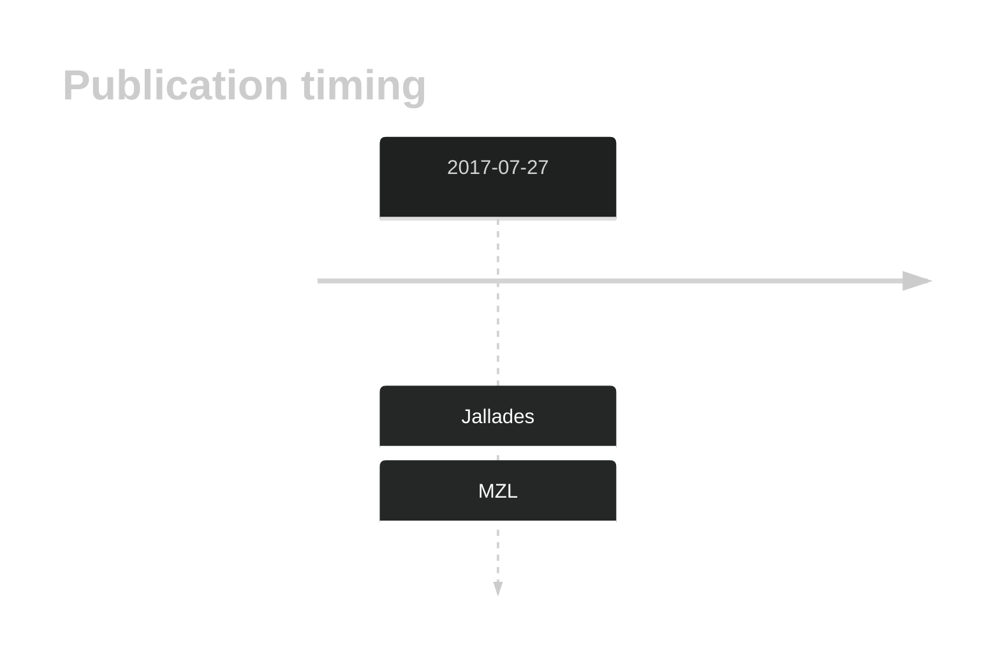

# DTX3L

## History

## Relevance tier by entity

|Entity|Tier|Description|
|:------:|:----:|--------------------------------------|
||2|relevance in MZL not firmly established[@jalladesExomeSequencingIdentifies2017]|

## Mutation incidence in large patient cohorts (GAMBL reanalysis)

TABLE2

## References

