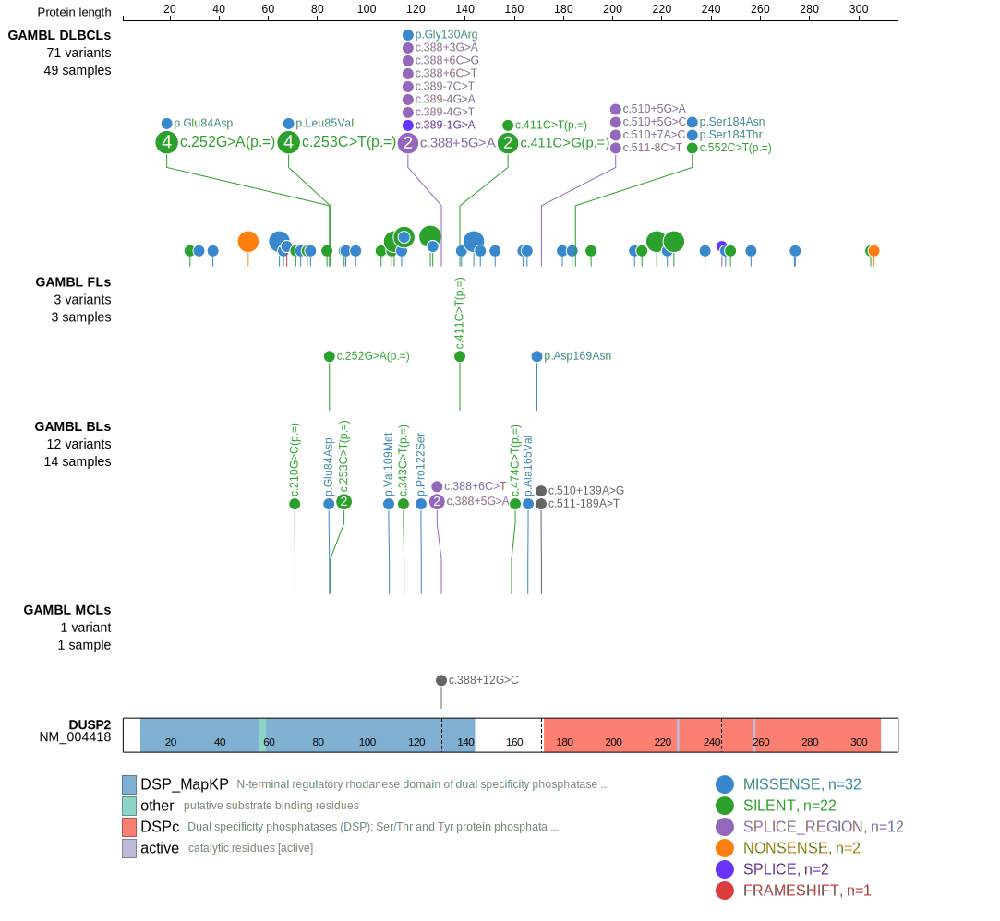
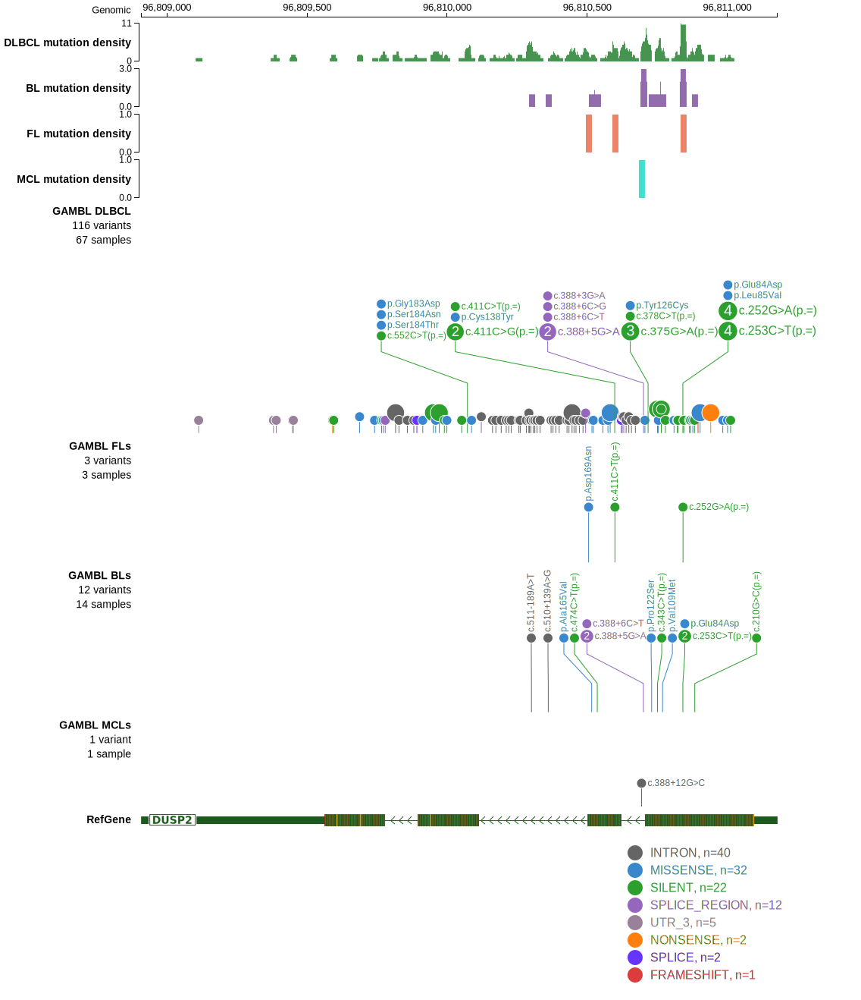

# DUSP2
DUSP2 is one of [a number of genes](https://github.com/morinlab/LLMPP/wiki/ashm) affected by aberrant somatic hypermutation in B-cell lymphomas, which complicates the interpretation of mutations at this locus.

## Mutation tier

|Entity|Tier|Description                           |
|:------:|:----:|--------------------------------------|
|DLBCL |1-a | aSHM target and high-confidence DLBCL gene            |
|FL    |2-a | aSHM target; Although recurrent, the relevance of mutations in FL is tenuous |
## Mutation incidence

|Entity|source        |frequency (%)|
|:------:|:--------------:|:-------------:|
|DLBCL |GAMBL genomes |10.13        |
|DLBCL |Schmitz cohort|12.55        |
|DLBCL |Reddy cohort  | 9.71        |
|DLBCL |Chapuy cohort | 4.27        |
|FL    |GAMBL genomes | 2.31        |

## Mutation pattern

|Entity|aSHM|Significant selection|dN/dS (missense)|dN/dS (nonsense)|
|:------:|:----:|:---------------------:|:----------------:|:----------------:|
|BL    |Yes |No                   |1.258           |17.913          |
|DLBCL |Yes |No                   |1.537           |12.012          |
|FL    |Yes |No                   |3.206           | 0.000          |

## aSHM regions

|chr_name|hg19_start|hg19_end|region                                                                                        |regulatory_comment|
|:--------:|:----------:|:--------:|:----------------------------------------------------------------------------------------------:|:------------------:|
|chr2    |96808901  |96811913|[intron-1](https://genome.ucsc.edu/s/rdmorin/GAMBL%20hg19?position=chr2%3A96808901%2D96811913)|enhancer          |

> [!NOTE]
> First described in DLBCL in 2017 by [Reddy A](https://pubmed.ncbi.nlm.nih.gov/28985567)

 ## DUSP2 Hotspots

| Chromosome |Coordinate (hg19) | ref>alt | HGVSp | 
 | :---:| :---: | :--: | :---: |
| chr2 | 96810877 | C>G | D73H |
| chr2 | 96810865 | G>A | R77W |
| chr2 | 96810842 | C>G | E84D |
| chr2 | 96810841 | G>C | L85V |
| chr2 | 96810730 | G>A | P122S |
| chr2 | 96810717 | T>C | Y126C |
| chr2 | 96810706 | C>T | G130R |
| chr2 | 96810597 | C>T | C138Y |
| chr2 | 96810582 | C>T | C143Y |
| chr2 | 96810574 | C>T | A146T |

View coding variants in ProteinPaint [hg19](https://www.bcgsc.ca/downloads/morinlab/GAMBL/test/genes/DUSP2_protein.html)  or [hg38](https://www.bcgsc.ca/downloads/morinlab/GAMBL/test/genes/DUSP2_protein_hg38.html)

View all variants in GenomePaint [hg19](https://www.bcgsc.ca/downloads/morinlab/GAMBL/test/genes/DUSP2.html)  or [hg38](https://www.bcgsc.ca/downloads/morinlab/GAMBL/test/genes/DUSP2_hg38.html)

