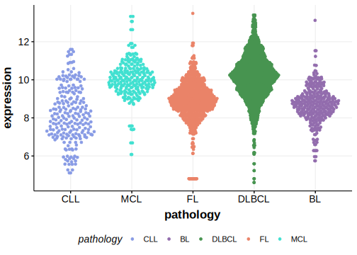

[[_TOC_]]

## Overview

DUSP2 functions as a negative regulator of MAPK signaling, particularly affecting the ERK1/2 pathway. 
DUSP2 mutations have been reported in nodular lymphocyte predominant Hodgkin lymphoma (NLPHL), T-cell/histiocyte-rich large B-cell lymphoma (T/HRLBCL)[@schuhmacherJUNBDUSP2SGK12019; @hartmannHighlyRecurrentMutations2016] and they are relatively frequent in DLBCL.  
DUSP2 is one of [a number of genes](https://github.com/morinlab/LLMPP/wiki/ashm) affected by aberrant somatic hypermutation in B-cell lymphomas, which complicates the interpretation of mutations at this locus. 
These mutations are associated with the ST2 genetic subgroup of DLBCL. 
This gene has some recurrent sites of mutations (hot spots). 
The mutation pattern in DLBCL implies the preferential accumulation of *inactivating mutations*.

## Relevance tier by entity

[[include:tables/table1_DUSP2.md]]

## Mutation incidence in large patient cohorts (GAMBL reanalysis)

### DLBCL
[[include:tables/DLBCL_DUSP2.md]]

### FL
[[include:tables/FL_DUSP2.md]]

## Mutation pattern and selective pressure estimates

[[include:tables/dnds_DUSP2.md]]

## aSHM regions

|chr_name|hg19_start|hg19_end|region                                                                                        |regulatory_comment|
|:--------:|:----------:|:--------:|:----------------------------------------------------------------------------------------------:|:------------------:|
|chr2    |96808901  |96811913|[intron-1](https://genome.ucsc.edu/s/rdmorin/GAMBL%20hg19?position=chr2%3A96808901%2D96811913)|enhancer          |

## DUSP2 Hotspots

| Chromosome |Coordinate (hg19) | ref>alt | HGVSp | 
 | :---:| :---: | :--: | :---: |
| chr2 | 96810877 | C>G | D73H |
| chr2 | 96810865 | G>A | R77W |
| chr2 | 96810842 | C>G | E84D |
| chr2 | 96810841 | G>C | L85V |
| chr2 | 96810730 | G>A | P122S |
| chr2 | 96810717 | T>C | Y126C |
| chr2 | 96810706 | C>T | G130R |
| chr2 | 96810597 | C>T | C138Y |
| chr2 | 96810582 | C>T | C143Y |
| chr2 | 96810574 | C>T | A146T |

[[include:browser_DUSP2.md]]

## Expression

<!-- ORIGIN: morinMutationalStructuralAnalysis2013 -->
<!-- PMBL: dunsCharacterizationDLBCLPMBL2021b -->
<!-- DLBCL: morinMutationalStructuralAnalysis2013 -->

[[include:tables/mermaid_DUSP2.md]]

## References

