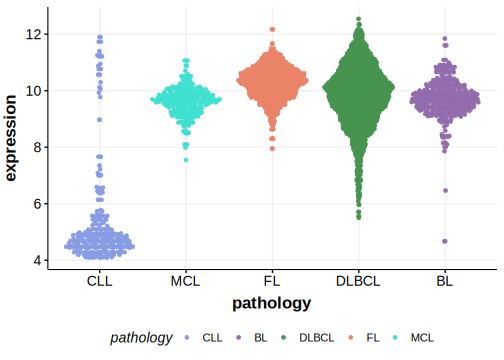

[[_TOC_]]

## Overview
EBF1 is a critical transcription factor in early B-cell development, regulating the expression of key genes involved in B-cell differentiation, survival, and function. EBF1 is essential for proper B-cell receptor (BCR) signaling.[@gyoryTranscriptionFactorEbf12012] Mutations in EBF1 can impair BCR signaling pathways, affecting B-cell survival and proliferation.[@gyoryTranscriptionFactorEbf12012] EBF1 is one of [a number of genes](https://github.com/morinlab/LLMPP/wiki/ashm) affected by aberrant somatic hypermutation in B-cell lymphomas, which complicates the interpretation of mutations at this locus. This gene has some recurrent sites of mutations (hot spots) but the mutation pattern in DLBCL and FL implies the preferential accumulation of *inactivating mutations*.

## Experimental Evidence

Driver mutations affecting this gene in DLBCL/FL have been experimentally demonstrated to cause a reduction or loss of function (LOF).[@ramirez-komoSpontaneousLossLineage2017]

## Relevance tier by entity

[[include:tables/table1_EBF1.md]]

## Mutation incidence in large patient cohorts (GAMBL reanalysis)

### DLBCL
[[include:tables/DLBCL_EBF1.md]]

### FL
[[include:tables/FL_EBF1.md]]

## Mutation pattern and selective pressure estimates

[[include:tables/dnds_EBF1.md]]

## aSHM regions

|chr_name|hg19_start|hg19_end |region                                                                                     |regulatory_comment|
|:--------:|:----------:|:---------:|:-------------------------------------------------------------------------------------------:|:------------------:|
|chr5    |158500476 |158532769|[TSS](https://genome.ucsc.edu/s/rdmorin/GAMBL%20hg19?position=chr5%3A158500476%2D158532769)|active_promoter   |

## EBF1 Hotspots

| Chromosome |Coordinate (hg19) | ref>alt | HGVSp | 
 | :---:| :---: | :--: | :---: |
| chr5 | 158526467 | C>T | S7N |
| chr5 | 158526456 | T>C | S11G |
| chr5 | 158526413 | T>C | N25S |
| chr5 | 158511720 | T>C | N147D |
| chr5 | 158511714 | C>T | E149K |
| chr5 | 158511705 | G>C | R152G |
| chr5 | 158511698 | A>C | L154W |
| chr5 | 158511677 | C>A | C161F |
| chr5 | 158500470 | C>T | R163H |
| chr5 | 158500468 | A>G | C164R |
| chr5 | 158500467 | C>G | C164S |

[[include:browser_EBF1.md]]

## Expression

<!-- ORIGIN: bohleRoleEarlyBcell2013 -->
<!-- BL: thomasGeneticSubgroupsInform2023 -->
<!-- PMBL: reichelFlowSortingExome2015a -->
<!-- DLBCL: bohleRoleEarlyBcell2013 -->

[[include:tables/mermaid_EBF1.md]]

## References

