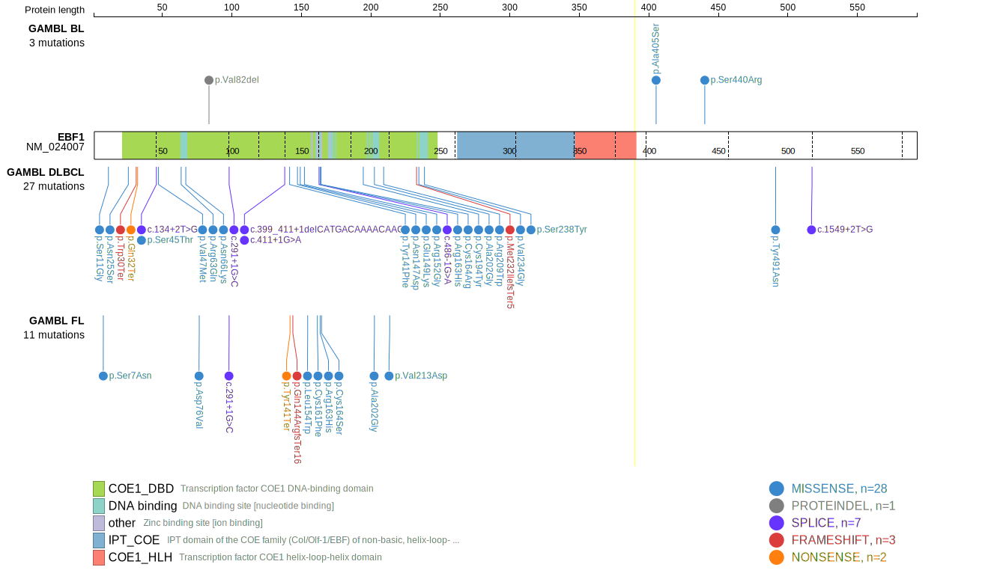
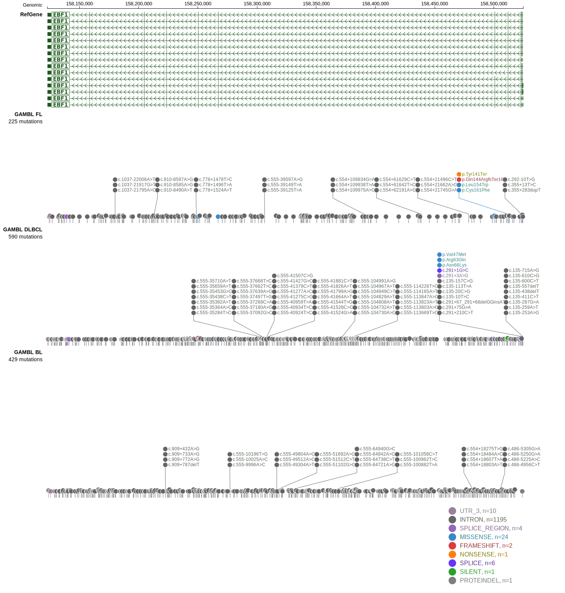

EBF1 is one of [a number of genes](https://github.com/morinlab/LLMPP/wiki/ashm) affected by aberrant somatic hypermutation in B-cell lymphomas, which complicates the interpretation of mutations at this locus.

## Mutation tier

|Entity|Tier|Description                           |
|:------:|:----:|--------------------------------------|
|BL    |2-a | aSHM target; Although recurrent, the relevance of mutations in BL is tenuous |
|DLBCL |1-a | aSHM target and high-confidence DLBCL gene            |
|FL    |1-a | aSHM target and high-confidence FL gene               |
## Mutation incidence

|Entity|source               |frequency (%)|
|:------:|:---------------------:|:-------------:|
|BL    |GAMBL genomes+capture| 2.08        |
|BL    |Thomas cohort        | 1.30        |
|BL    |Panea cohort         | 5.90        |
|DLBCL |GAMBL genomes        | 8.99        |
|DLBCL |Schmitz cohort       |10.85        |
|DLBCL |Reddy cohort         | 8.81        |
|DLBCL |Chapuy cohort        |12.82        |
|FL    |GAMBL genomes        | 8.55        |

## Mutation pattern

|Entity|aSHM|Significant selection|dN/dS (missense)|dN/dS (nonsense)|
|:------:|:----:|:---------------------:|:----------------:|:----------------:|
|BL    |Yes |No                   | 2.304          | 0.000          |
|DLBCL |Yes |Yes                  |11.910          |66.114          |
|FL    |Yes |Yes                  |17.826          |91.742          |

## aSHM regions

|chr_name|hg19_start|hg19_end |region                                                                                     |regulatory_comment|
|:--------:|:----------:|:---------:|:-------------------------------------------------------------------------------------------:|:------------------:|
|chr5    |158500476 |158532769|[TSS](https://genome.ucsc.edu/s/rdmorin/GAMBL%20hg19?position=chr5%3A158500476%2D158532769)|active_promoter   |

 ## EBF1 Hotspots

| Chromosome |Coordinate (hg19) | ref>alt | HGVSp | 
 | :---:| :---: | :--: | :---: |
| chr5 | 158526467 | C>T | S7N |
| chr5 | 158526456 | T>C | S11G |
| chr5 | 158526413 | T>C | N25S |
| chr5 | 158511720 | T>C | N147D |
| chr5 | 158511714 | C>T | E149K |
| chr5 | 158511705 | G>C | R152G |
| chr5 | 158511698 | A>C | L154W |
| chr5 | 158511677 | C>A | C161F |
| chr5 | 158500470 | C>T | R163H |
| chr5 | 158500468 | A>G | C164R |
| chr5 | 158500467 | C>G | C164S |

View coding variants in ProteinPaint [hg19](https://www.bcgsc.ca/downloads/morinlab/GAMBL/test/genes/EBF1_protein.html)  or [hg38](https://www.bcgsc.ca/downloads/morinlab/GAMBL/test/genes/EBF1_protein_hg38.html)

View all variants in GenomePaint [hg19](https://www.bcgsc.ca/downloads/morinlab/GAMBL/test/genes/EBF1.html)  or [hg38](https://www.bcgsc.ca/downloads/morinlab/GAMBL/test/genes/EBF1_hg38.html)

