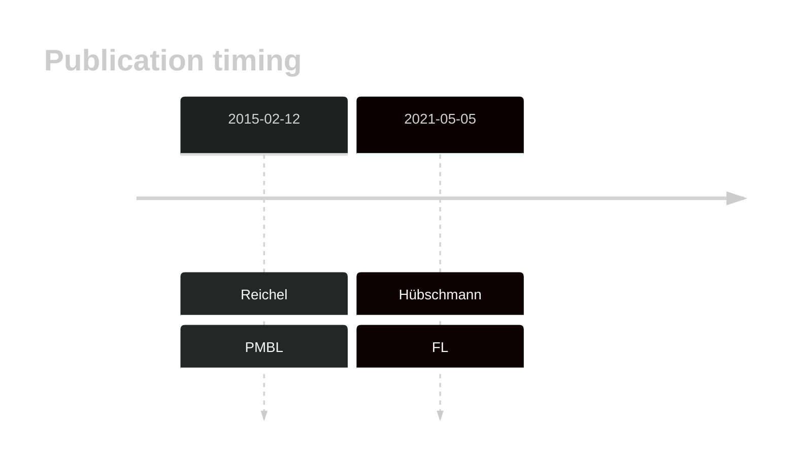

# EEF1A1

## Overview
Mutations in the EEF1A1 gene, which encodes the eukaryotic translation elongation factor 1A1, have been reported in DLBCL and FL.1 This gene has some recurrent sites of mutations (hot spots). The mutation pattern in DLBCL and FL implies the preferential accumulation of *inactivating mutations*. Paradoxically, one study showed that EEF1A1 knock down reduced proliferation in vitro and in xenograft experiments.2

## History
Mutations in this gene were first described in DLBCL and FL in 2021 by Hübschmann et al.1

## Relevance tier by entity

|Entity|Tier|Description                           |
|:------:|:----:|--------------------------------------|
||1|high-confidence PMBL/cHL/GZL gene[@reichelFlowSortingExome2015a]|
| |1   |high-confidence DLBCL gene            [@hubschmannMutationalMechanismsShaping2021b]|
|    |1   |high-confidence FL gene[@hubschmannMutationalMechanismsShaping2021b]|

## Mutation incidence in large patient cohorts (GAMBL reanalysis)

|Entity|source        |frequency (%)|
|:------:|:--------------:|:-------------:|
|DLBCL |GAMBL genomes | 4.78        |
|DLBCL |Schmitz cohort| 2.98        |
|DLBCL |Reddy cohort  | 2.50        |
|DLBCL |Chapuy cohort | 4.70        |
|FL    |GAMBL genomes |11.32        |

## Mutation pattern and selective pressure estimates

|Entity|aSHM|Significant selection|dN/dS (missense)|dN/dS (nonsense)|
|:------:|:----:|:---------------------:|:----------------:|:----------------:|
|BL    |No  |No                   | 6.692          | 0.000          |
|DLBCL |No  |No                   | 3.556          |24.091          |
|FL    |No  |Yes                  |47.451          | 0.000          |

## EEF1A1 Hotspots

| Chromosome |Coordinate (hg19) | ref>alt | HGVSp | 
| :---:| :---: | :--: | :---: |
|chr6|74229191|C>T|A65T|
|chr6|74229191|C>G|A65P|
|chr6|74229190|G>C|A65G|
|chr6|74229188|C>T|E66K|
|chr6|74229187|T>A|E66V|
|chr6|74229179|G>C|R69G|
|chr6|74229179|G>A|R69C|
| chr6 | 74229094 | T>A | D97V |
| chr6 | 74229095 | C>T | D97N |

View coding variants in ProteinPaint [hg19](https://morinlab.github.io/LLMPP/GAMBL/EEF1A1_protein.html)  or [hg38](https://morinlab.github.io/LLMPP/GAMBL/EEF1A1_protein_hg38.html)

View all variants in GenomePaint [hg19](https://morinlab.github.io/LLMPP/GAMBL/EEF1A1.html)  or [hg38](https://morinlab.github.io/LLMPP/GAMBL/EEF1A1_hg38.html)

2. *Gong T, Shuang Y. Expression and Clinical Value of Eukaryotic Translation Elongation Factor 1A1 (EEF1A1) in Diffuse Large B Cell Lymphoma. Int J Gen Med. 2021 Oct 27;14:7247-7258. doi: 10.2147/IJGM.S324645. PMID: 34737619; PMCID: PMC8559353.*
## EEF1A1 Expression

<!-- ORIGIN: reichelFlowSortingExome2015a -->
<!-- DLBCL: hubschmannMutationalMechanismsShaping2021b -->
<!-- FL: hubschmannMutationalMechanismsShaping2021b -->
<!-- PMBL: reichelFlowSortingExome2015a -->
## References