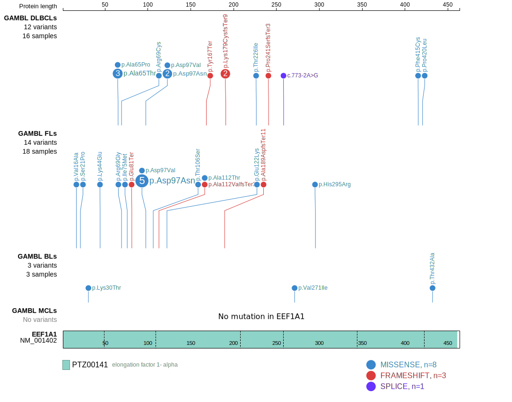
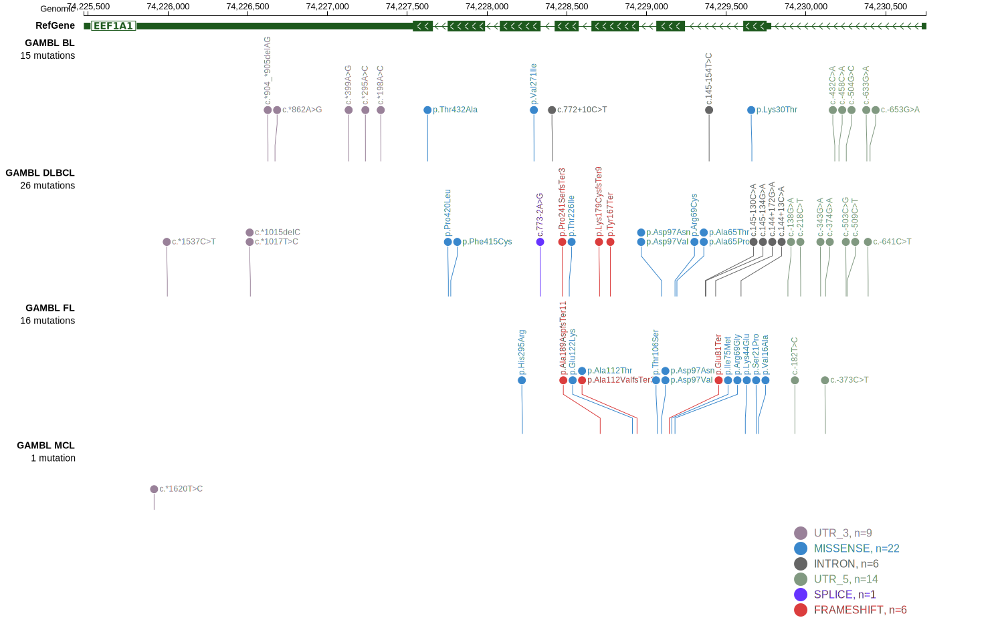

# EEF1A1
## Overview
Mutations in the EEF1A1 gene, which encodes the eukaryotic translation elongation factor 1A1, have been reported in DLBCL and FL.1 This gene has some recurrent sites of mutations (hot spots). The mutation pattern in DLBCL and FL implies the preferential accumulation of *inactivating mutations*. Paradoxically, one study showed that EEF1A1 knock down reduced proliferation in vitro and in xenograft experiments.2

## Relevance tier by entity

|Entity|Tier|Description                           |
|:------:|:----:|--------------------------------------|
|DLBCL |1   |high-confidence DLBCL gene            |
|FL    |2   |relevance in FL not firmly established|

## Mutation incidence in large patient cohorts (GAMBL reanalysis)

|Entity|source        |frequency (%)|
|:------:|:--------------:|:-------------:|
|DLBCL |GAMBL genomes | 4.78        |
|DLBCL |Schmitz cohort| 2.98        |
|DLBCL |Reddy cohort  | 2.50        |
|DLBCL |Chapuy cohort | 4.70        |
|FL    |GAMBL genomes |11.32        |

## Mutation pattern and selective pressure estimates

|Entity|aSHM|Significant selection|dN/dS (missense)|dN/dS (nonsense)|
|:------:|:----:|:---------------------:|:----------------:|:----------------:|
|BL    |No  |No                   | 6.692          | 0.000          |
|DLBCL |No  |No                   | 3.556          |24.091          |
|FL    |No  |Yes                  |47.451          | 0.000          |

 ## EEF1A1 Hotspots

| Chromosome |Coordinate (hg19) | ref>alt | HGVSp | 
| :---:| :---: | :--: | :---: |
|chr6|74229191|C>T|A65T|
|chr6|74229191|C>G|A65P|
|chr6|74229190|G>C|A65G|
|chr6|74229188|C>T|E66K|
|chr6|74229187|T>A|E66V|
|chr6|74229179|G>C|R69G|
|chr6|74229179|G>A|R69C|
| chr6 | 74229094 | T>A | D97V |
| chr6 | 74229095 | C>T | D97N |

View coding variants in ProteinPaint [hg19](https://morinlab.github.io/LLMPP/GAMBL/EEF1A1_protein.html)  or [hg38](https://morinlab.github.io/LLMPP/GAMBL/EEF1A1_protein_hg38.html)

View all variants in GenomePaint [hg19](https://morinlab.github.io/LLMPP/GAMBL/EEF1A1.html)  or [hg38](https://morinlab.github.io/LLMPP/GAMBL/EEF1A1_hg38.html)

## References
1. *Hübschmann D, Kleinheinz K, Wagener R, Bernhart SH, López C, Toprak UH, Sungalee S, Ishaque N, Kretzmer H, Kreuz M, Waszak SM, Paramasivam N, Ammerpohl O, Aukema SM, Beekman R, Bergmann AK, Bieg M, Binder H, Borkhardt A, Borst C, Brors B, Bruns P, Carrillo de Santa Pau E, Claviez A, Doose G, Haake A, Karsch D, Haas S, Hansmann ML, Hoell JI, Hovestadt V, Huang B, Hummel M, Jäger-Schmidt C, Kerssemakers JNA, Korbel JO, Kube D, Lawerenz C, Lenze D, Martens JHA, Ott G, Radlwimmer B, Reisinger E, Richter J, Rico D, Rosenstiel P, Rosenwald A, Schillhabel M, Stilgenbauer S, Stadler PF, Martín-Subero JI, Szczepanowski M, Warsow G, Weniger MA, Zapatka M, Valencia A, Stunnenberg HG, Lichter P, Möller P, Loeffler M, Eils R, Klapper W, Hoffmann S, Trümper L; ICGC MMML-Seq consortium; ICGC DE-Mining consortium; BLUEPRINT consortium; Küppers R, Schlesner M, Siebert R. Mutational mechanisms shaping the coding and noncoding genome of germinal center derived B-cell lymphomas. Leukemia. 2021 Jul;35(7):2002-2016. doi: 10.1038/s41375-021-01251-z. Epub 2021 May 5. PMID: 33953289; PMCID: PMC8257491.*
2. *Gong T, Shuang Y. Expression and Clinical Value of Eukaryotic Translation Elongation Factor 1A1 (EEF1A1) in Diffuse Large B Cell Lymphoma. Int J Gen Med. 2021 Oct 27;14:7247-7258. doi: 10.2147/IJGM.S324645. PMID: 34737619; PMCID: PMC8559353.*
