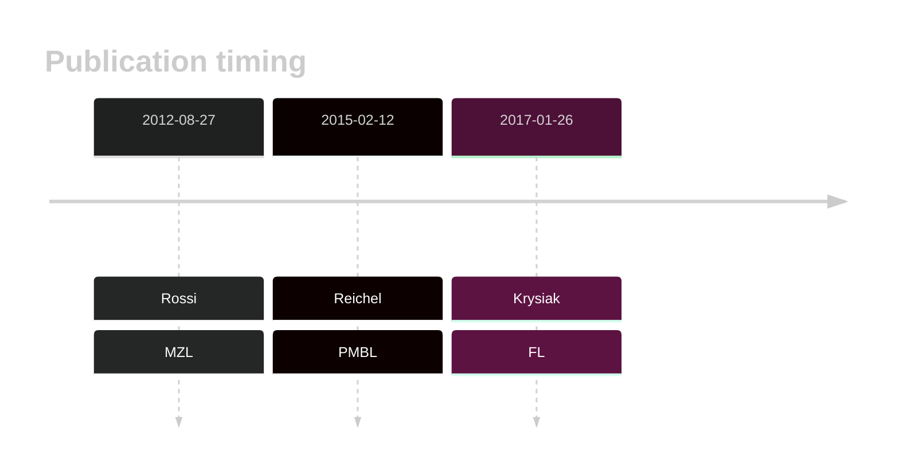

# EGR1

## History

## Relevance tier by entity

|Entity|Tier|Description|
|:------:|:----:|--------------------------------------|
||2|relevance in FL not firmly established[@krysiakRecurrentSomaticMutations2017]|
||2|relevance in MZL not firmly established[@rossiCodingGenomeSplenic2012]|
||2|relevance in PMBL/cHL/GZL not firmly established[@reichelFlowSortingExome2015]|

## Mutation incidence in large patient cohorts (GAMBL reanalysis)

|Entity|source |frequency (%)|
|:------:|:----:|:----:|
|BL|GAMBL Exome |3.448 |
|BL|GAMBL Genome |0.386 |
|DLBCL|GAMBL Exome |4.69 |
|DLBCL|GAMBL Genome |3.571 |
|FL|GAMBL Exome |3.152 |

## References

