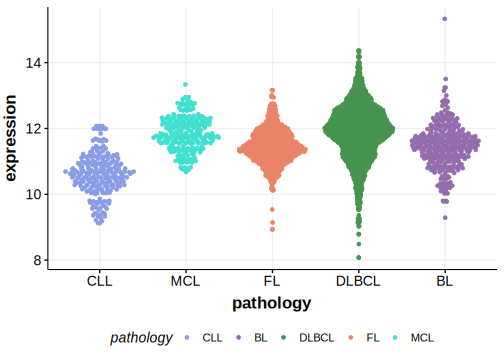

# EHD1

## Relevance tier by entity

[[include:tables/table1_EHD1.md]]

## Mutation incidence in large patient cohorts (GAMBL reanalysis)

|Entity|source               |frequency (%)|
|:------:|:---------------------:|:-------------:|
|BL    |GAMBL genomes+capture|1.39         |
|BL    |Thomas cohort        |0.00         |
|BL    |Panea cohort         |5.90         |

## Mutation pattern and selective pressure estimates

[[include:tables/dnds_EHD1.md]]

[[include:browser_EHD1.md]]

## Expression

<!-- ORIGIN: Unknown -->
<!-- BL: thomasGeneticSubgroupsInform2023 -->

## References
