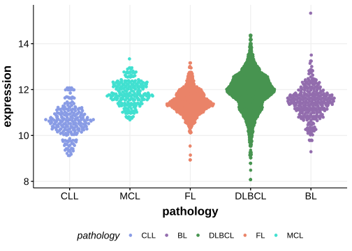

# EHD1

## Relevance tier by entity

[[include:tables/table1_EHD1.md]]

## Mutation incidence in large patient cohorts (GAMBL reanalysis)

### FL
[[include:tables/BL_EHD1.md]]

### DLBCL
[[include:tables/DLBCL_EHD1.md]]

### FL
[[include:tables/FL_EHD1.md]]

## Mutation pattern and selective pressure estimates

[[include:tables/dnds_EHD1.md]]

[[include:tables/browser_EHD1.md]]

## Expression

<!-- ORIGIN: Unknown -->
<!-- BL: thomasGeneticSubgroupsInform2023 -->

## References
