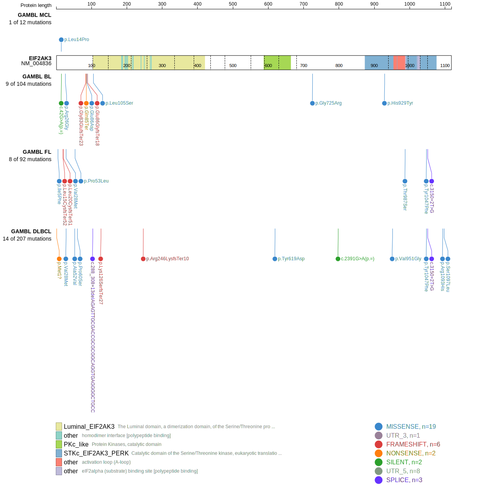
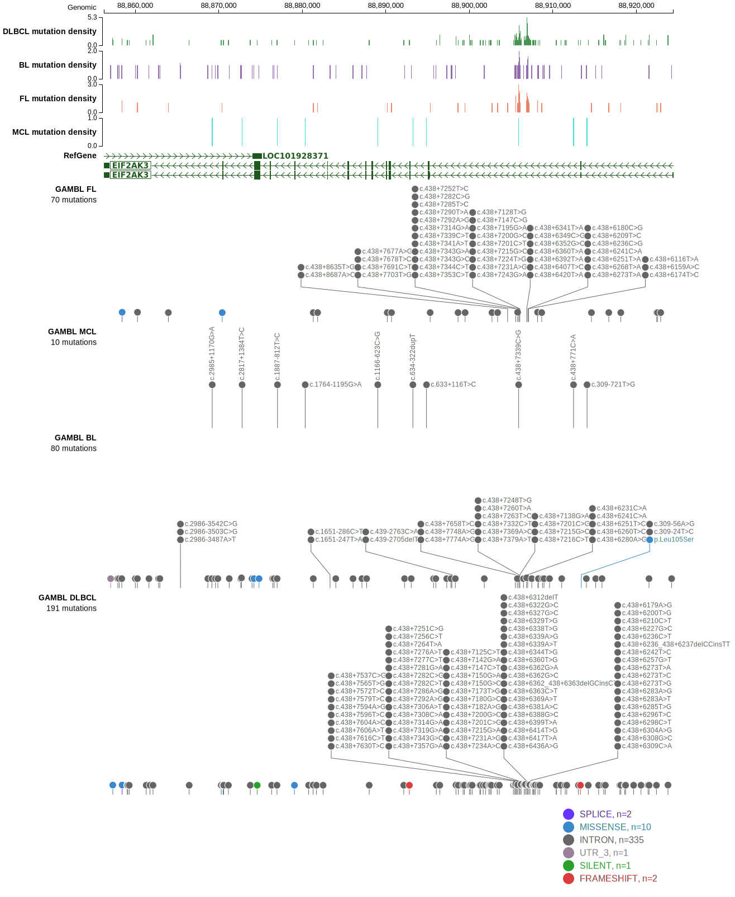
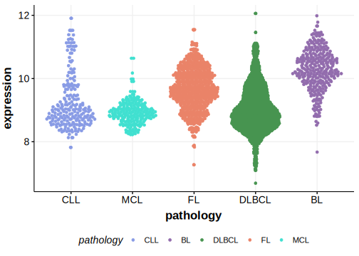

# EIF2AK3

## Relevance tier by entity

|Entity|Tier|Description                              |
|:------:|:----:|-----------------------------------------|
| |2   |relevance in DLBCL not firmly established|

## Mutation incidence in large patient cohorts (GAMBL reanalysis)

|Entity|source        |frequency (%)|
|:------:|:--------------:|:-------------:|
|DLBCL |GAMBL genomes |3.44         |
|DLBCL |Schmitz cohort|2.34         |
|DLBCL |Reddy cohort  |1.50         |
|DLBCL |Chapuy cohort |2.99         |

## Mutation pattern and selective pressure estimates

|Entity|aSHM|Significant selection|dN/dS (missense)|dN/dS (nonsense)|
|:------:|:----:|:---------------------:|:----------------:|:----------------:|
|BL    |No  |No                   |2.775           |12.366          |
|DLBCL |No  |No                   |1.884           |18.647          |
|FL    |No  |No                   |9.265           |22.931          |

View coding variants in ProteinPaint [hg19](https://morinlab.github.io/LLMPP/GAMBL/EIF2AK3_protein.html)  or [hg38](https://morinlab.github.io/LLMPP/GAMBL/EIF2AK3_protein_hg38.html)

View all variants in GenomePaint [hg19](https://morinlab.github.io/LLMPP/GAMBL/EIF2AK3.html)  or [hg38](https://morinlab.github.io/LLMPP/GAMBL/EIF2AK3_hg38.html)

## EIF2AK3 Expression

<!-- ORIGIN: Unknown -->
