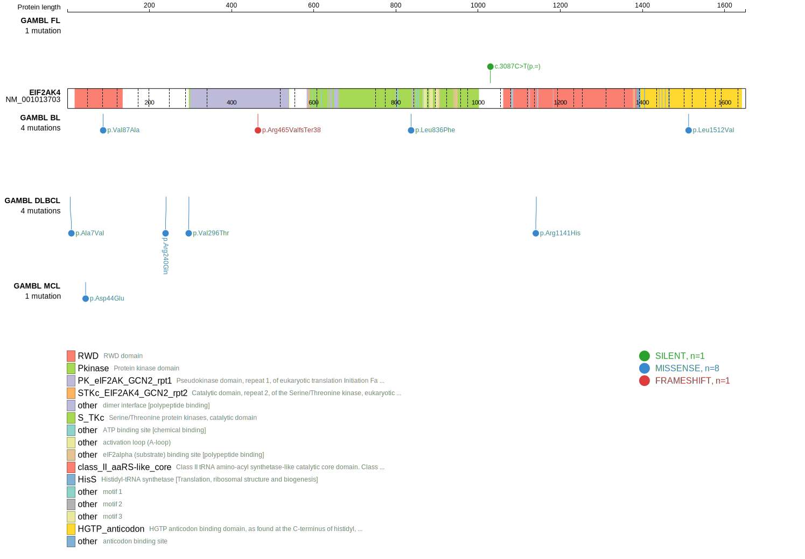
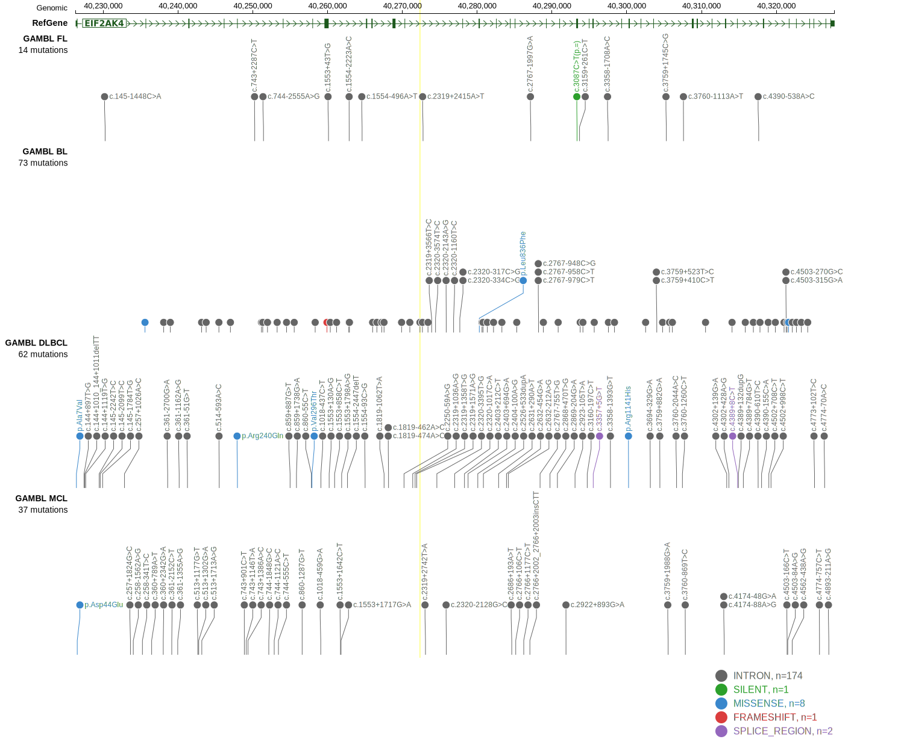

# [EIF2AK4]

## Mutation tier

|Entity|Tier|Description                            |
|:------:|:----:|---------------------------------------|
|MCL   |2   |relevance in MCL not firmly established|
## Mutation incidence

|Entity|source       |frequency (%)|
|:------:|:-------------:|:-------------:|
|MCL   |GAMBL genomes|0.47         |

## Mutation pattern

|Entity|aSHM|Significant selection|dN/dS (missense)|dN/dS (nonsense)|
|:------:|:----:|:---------------------:|:----------------:|:----------------:|
|BL    |No  |No                   |1.923           |0               |
|DLBCL |No  |No                   |2.632           |0               |
|FL    |No  |No                   |0.000           |0               |

> [!NOTE]
> First described in MCL in 2014 by [Zhang J](https://pubmed.ncbi.nlm.nih.gov/24682267)

View coding variants in ProteinPaint [hg19](https://www.bcgsc.ca/downloads/morinlab/GAMBL/test/genes/EIF2AK4_protein.html)  or [hg38](https://www.bcgsc.ca/downloads/morinlab/GAMBL/test/genes/EIF2AK4_protein_hg38.html)

View all variants in GenomePaint [hg19](https://www.bcgsc.ca/downloads/morinlab/GAMBL/test/genes/EIF2AK4.html)  or [hg38](https://www.bcgsc.ca/downloads/morinlab/GAMBL/test/genes/EIF2AK4_hg38.html)

