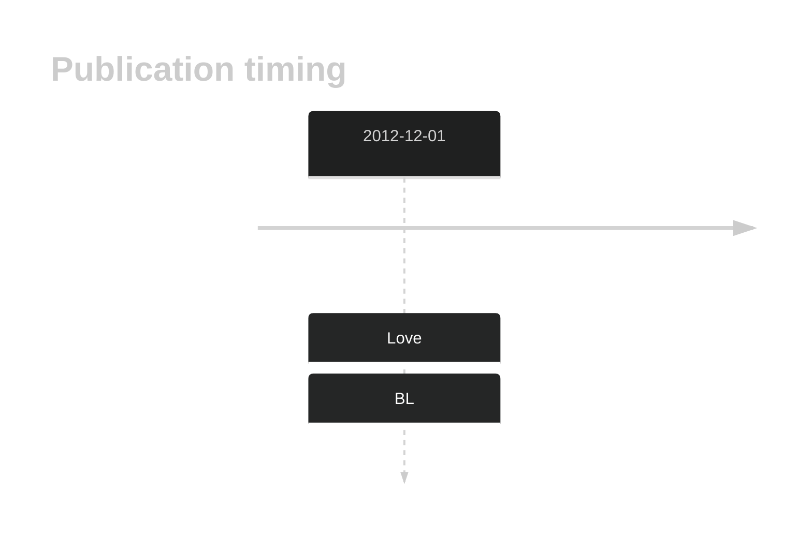

# EIF2C4

## History

## Relevance tier by entity

|Entity|Tier|Description                           |
|:------:|:----:|--------------------------------------|
|    |2   |relevance in BL not firmly established|

## Mutation incidence in large patient cohorts (GAMBL reanalysis)

|Entity|source               |frequency (%)|
|:------:|:---------------------:|:-------------:|
|BL    |GAMBL genomes+capture|NA           |
|BL    |Thomas cohort        |NA           |
|BL    |Panea cohort         |NA           |

View coding variants in ProteinPaint [hg19](https://morinlab.github.io/LLMPP/GAMBL/EIF2C4_protein.html)  or [hg38](https://morinlab.github.io/LLMPP/GAMBL/EIF2C4_protein_hg38.html)

View all variants in GenomePaint [hg19](https://morinlab.github.io/LLMPP/GAMBL/EIF2C4.html)  or [hg38](https://morinlab.github.io/LLMPP/GAMBL/EIF2C4_hg38.html)

<!-- ORIGIN: loveGeneticLandscapeMutations2012 -->
<!-- BL: loveGeneticLandscapeMutations2012 -->

## Representative Mutation

**Rating**
&starf; &star; &star; &star; &star;

## All Mutations

[1063](https://www.bcgsc.ca/downloads/morinlab/GAMBL/Love/1063_reports.html)
[1091](https://www.bcgsc.ca/downloads/morinlab/GAMBL/Love/1091_reports.html)
[698](https://www.bcgsc.ca/downloads/morinlab/GAMBL/Love/698_reports.html)

## References
1.  Love C, Sun Z, Jima D, Li G, Zhang J, Miles R, Richards KL, Dunphy CH, Choi WWL, Srivastava G, Lugar PL, Rizzieri DA, Lagoo AS, Bernal-Mizrachi L, Mann KP, Flowers CR, Naresh KN, Evens AM, Chadburn A, Gordon LI, Czader MB, Gill JI, Hsi ED, Greenough A, Moffitt AB, McKinney M, Banerjee A, Grubor V, Levy S, Dunson DB, Dave SS. The genetic landscape of mutations in Burkitt lymphoma. Nat Genet. 2012 Dec;44(12):1321–1325. PMCID: PMC3674561
