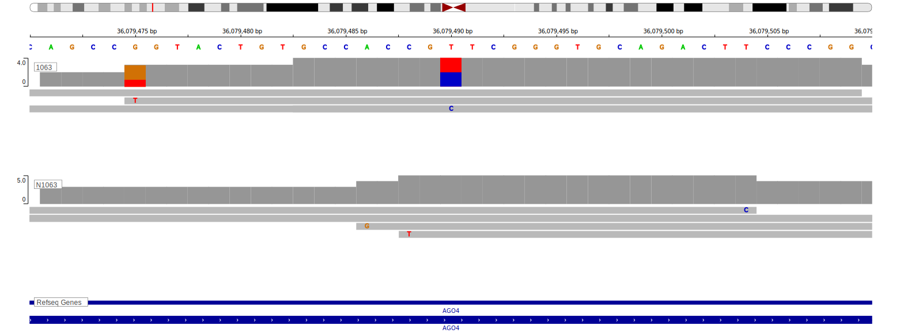

[[_TOC_]]

<<Warn("The variants reported in this gene in BL failed QC")>>

## Relevance tier by entity

|Entity|Tier|Description                           |
|:------:|:----:|--------------------------------------|
|    |2   | Failed QC[@loveGeneticLandscapeMutations2012]|

## Mutation incidence in large patient cohorts (GAMBL reanalysis)

|Entity|source               |frequency (%)|
|:------:|:---------------------:|:-------------:|
|BL    |GAMBL genomes+capture|NA           |
|BL    |Thomas cohort        |NA           |
|BL    |Panea cohort         |NA           |

View coding variants in ProteinPaint [hg19](https://morinlab.github.io/LLMPP/GAMBL/EIF2C4_protein.html)  or [hg38](https://morinlab.github.io/LLMPP/GAMBL/EIF2C4_protein_hg38.html)

View all variants in GenomePaint [hg19](https://morinlab.github.io/LLMPP/GAMBL/EIF2C4.html)  or [hg38](https://morinlab.github.io/LLMPP/GAMBL/EIF2C4_hg38.html)

<!-- ORIGIN: loveGeneticLandscapeMutations2012 -->
<!-- BL: loveGeneticLandscapeMutations2012 -->

## Representative Mutation

**Rating**
&starf; &star; &star; &star; &star;

## All Mutations

[1063](https://www.bcgsc.ca/downloads/morinlab/GAMBL/Love/1063_reports.html)
[1091](https://www.bcgsc.ca/downloads/morinlab/GAMBL/Love/1091_reports.html)
[698](https://www.bcgsc.ca/downloads/morinlab/GAMBL/Love/698_reports.html)

[[include:mermaid_EIF2C4.md]]

## References
