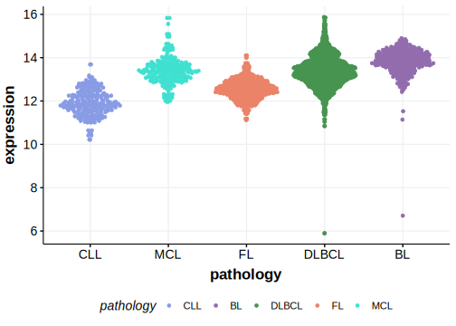

[[_TOC_]]

## Relevance tier by entity

[[include:table1_EIF4A1.md]]

## Mutation incidence in large patient cohorts (GAMBL reanalysis)

|Entity|source               |frequency (%)|
|:------:|:---------------------:|:-------------:|
|BL    |GAMBL genomes+capture|4.85         |
|BL    |Thomas cohort        |5.10         |
|BL    |Panea cohort         |6.90         |

## Mutation pattern and selective pressure estimates

[[include:dnds_EIF4A1.md]]

[[include:browser_EIF4A1.md]]

## Expression

<!-- ORIGIN: paneaWholeGenomeLandscape2019 -->
<!-- BL: paneaWholeGenomeLandscape2019 -->

[[include:mermaid_EIF4A1.md]]

## References
