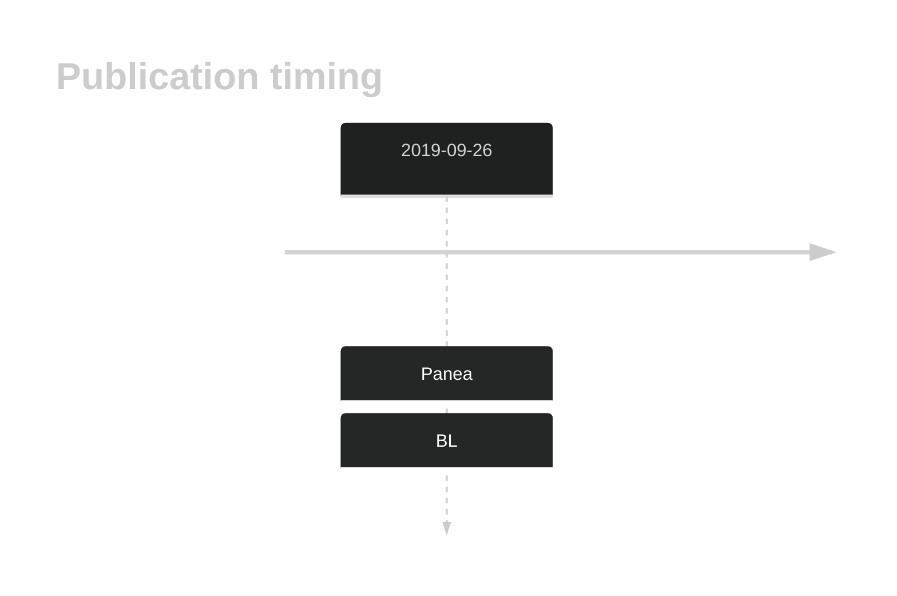

# EIF4A1

## History

## Relevance tier by entity

|Entity|Tier|Description            |
|:------:|:----:|-----------------------|
|    |1   |high-confidence BL gene[@paneaWholeGenomeLandscape2019]|

## Mutation incidence in large patient cohorts (GAMBL reanalysis)

|Entity|source               |frequency (%)|
|:------:|:---------------------:|:-------------:|
|BL    |GAMBL genomes+capture|4.85         |
|BL    |Thomas cohort        |5.10         |
|BL    |Panea cohort         |6.90         |

## Mutation pattern and selective pressure estimates

|Entity|aSHM|Significant selection|dN/dS (missense)|dN/dS (nonsense)|
|:------:|:----:|:---------------------:|:----------------:|:----------------:|
|BL    |No  |No                   |8.506           |0               |
|DLBCL |No  |No                   |2.745           |0               |
|FL    |No  |No                   |0.000           |0               |

View coding variants in ProteinPaint [hg19](https://morinlab.github.io/LLMPP/GAMBL/EIF4A1_protein.html)  or [hg38](https://morinlab.github.io/LLMPP/GAMBL/EIF4A1_protein_hg38.html)

View all variants in GenomePaint [hg19](https://morinlab.github.io/LLMPP/GAMBL/EIF4A1.html)  or [hg38](https://morinlab.github.io/LLMPP/GAMBL/EIF4A1_hg38.html)

## EIF4A1 Expression

<!-- ORIGIN: paneaWholeGenomeLandscape2019 -->
<!-- BL: paneaWholeGenomeLandscape2019 -->

## References
