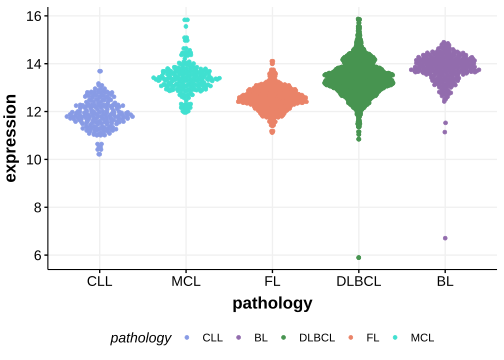

[[_TOC_]]

## Relevance tier by entity

[[include:tables/table1_EIF4A1.md]]

## Mutation incidence in large patient cohorts (GAMBL reanalysis)

### BL
[[include:tables/BL_EIF4A1.md]]

### DLBCL
[[include:tables/DLBCL_EIF4A1.md]]

### FL
[[include:tables/FL_EIF4A1.md]]

## Mutation pattern and selective pressure estimates

## Mutation pattern and selective pressure estimates

[[include:tables/dnds_EIF4A1.md]]

[[include:tables/browser_EIF4A1.md]]

## Expression

<!-- ORIGIN: paneaWholeGenomeLandscape2019 -->
<!-- BL: paneaWholeGenomeLandscape2019 -->

[[include:tables/mermaid_EIF4A1.md]]

## References
