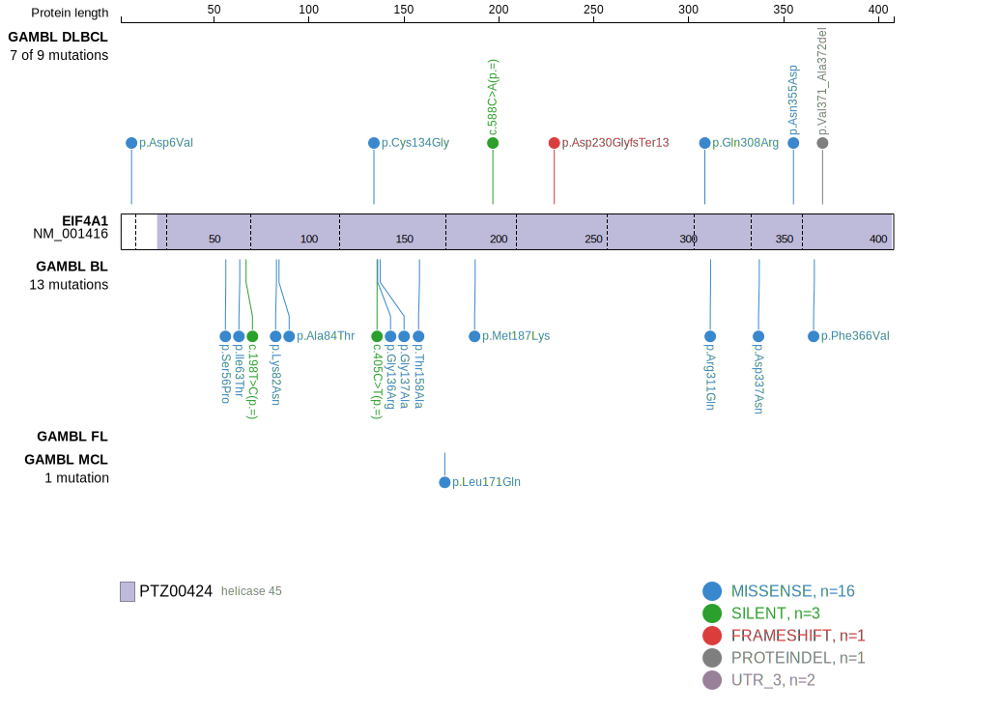

# [EIF4A1]

## Mutation tier

|Entity|Tier|Description            |
|:------:|:----:|-----------------------|
|BL    |1   |high-confidence BL gene|
## Mutation incidence

|Entity|source               |frequency (%)|
|:------:|:---------------------:|:-------------:|
|BL    |GAMBL genomes+capture|4.85         |
|BL    |Thomas cohort        |5.10         |
|BL    |Panea cohort         |6.90         |

## Mutation pattern

|Entity|aSHM|Significant selection|dN/dS (missense)|dN/dS (nonsense)|
|:------:|:----:|:---------------------:|:----------------:|:----------------:|
|BL    |No  |No                   |8.506           |0               |
|DLBCL |No  |No                   |2.745           |0               |
|FL    |No  |No                   |0.000           |0               |

> [!NOTE]
> First described in BL in 2019 by [Panea RI](https://pubmed.ncbi.nlm.nih.gov/31558468)

View coding variants in ProteinPaint [hg19](https://www.bcgsc.ca/downloads/morinlab/GAMBL/test/genes/EIF4A1_protein.html)  or [hg38](https://www.bcgsc.ca/downloads/morinlab/GAMBL/test/genes/EIF4A1_protein_hg38.html)

View all variants in GenomePaint [hg19](https://www.bcgsc.ca/downloads/morinlab/GAMBL/test/genes/EIF4A1.html)

