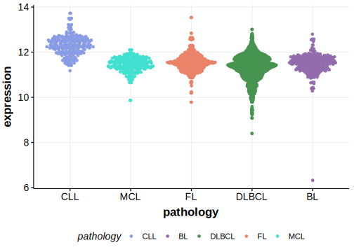

[[_TOC_]]

## Overview
Mutations in EP300 are significant contributors to the pathogenesis and progression of B-cell lymphomas such as DLBCL and FL.[@pasqualucciInactivatingMutationsAcetyltransferase2011] This gene has some recurrent sites of mutations (hot spots), which typically impact its HAT domain, a region crucial for acetylating histones and non-histone proteins.[@pasqualucciInactivatingMutationsAcetyltransferase2011]

## Experimental Evidence
EP300 mutations impair histone acetylation, disrupt epigenetic gene regulation. Mutations in CREBBP and EP300 affect a common pathway and have been described as mutually exclusive due to some functional redundancy.[@pasqualucciInactivatingMutationsAcetyltransferase2011; @veazeyCARM1InhibitionReduces2020]
Studies using genome-wide CRISPR-Cas9 screens have identified synthetic lethal interactions between CREBBP and EP300, suggesting that targeting one may affect the viability of cells with mutations in the other.[@nieGenomewideCRISPRScreens2021]

## Relevance tier by entity

[[include:tables/table1_EP300.md]]

## Mutation incidence in large patient cohorts (GAMBL reanalysis)

### DLBCL
[[include:tables/DLBCL_EP300.md]]

### FL
[[include:tables/FL_EP300.md]]

## Mutation pattern and selective pressure estimates

[[include:tables/dnds_EP300.md]]

## EP300 Hotspots

| Chromosome |Coordinate (hg19) | ref>alt | HGVSp | 
 | :---:| :---: | :--: | :---: |
|chr22|41566459|T>C|Y1446H|
|chr22|41566460|A>G|Y1446C|
|chr22|41566460|A>C|Y1446S|
|chr22|41566462|A>T|I1447F|
|chr22|41566466|T>G|F1448C|
|chr22|41566474|C>T|H1451Y|
|chr22|41566476|T>G|H1451Q|
|chr22|41566478 | C>T | P1452L |
|chr22|41566486|C>G|Q1455E|
|chr22|41566487|A>G|Q1455R|
|chr22|41566488|G>T|Q1455H|
|chr22|41566495|C>T|P1458S|
|chr22|41566495|C>A|P1458T|
|chr22|41566496|C>T|P1458L|
|chr22|41566511|T>C|L1463P|
|chr22|41566511|T>G|L1463R|
|chr22|41566519|T>G|W1466G|
|chr22|41566519|T>A|W1466R|
|chr22|41566519|T>C|W1466R|
|chr22|41566520|G>T|W1466L|
|chr22|41566521|G>C|W1466C|
|chr22| 41566522 | T>A | Y1467N |
|chr22| 41566522 | T>C | Y1467H |
|chr22| 41566522 | T>G | Y1467D |
|chr22| 41566523 | A>G | Y1467C |
|chr22| 41566523 | A>T | Y1467F |

[[include:browser_EP300.md]]

## Expression

[[include:tables/mermaid_EP300.md]]

## References

<!-- ORIGIN: 21390126 -->
<!-- FL: pasqualucciInactivatingMutationsAcetyltransferase2011a -->
<!-- BL: paneaWholeGenomeLandscape2019 -->
<!-- MZL: rossiCodingGenomeSplenic2012c -->
<!-- DLBCL: pasqualucciInactivatingMutationsAcetyltransferase2011a -->
