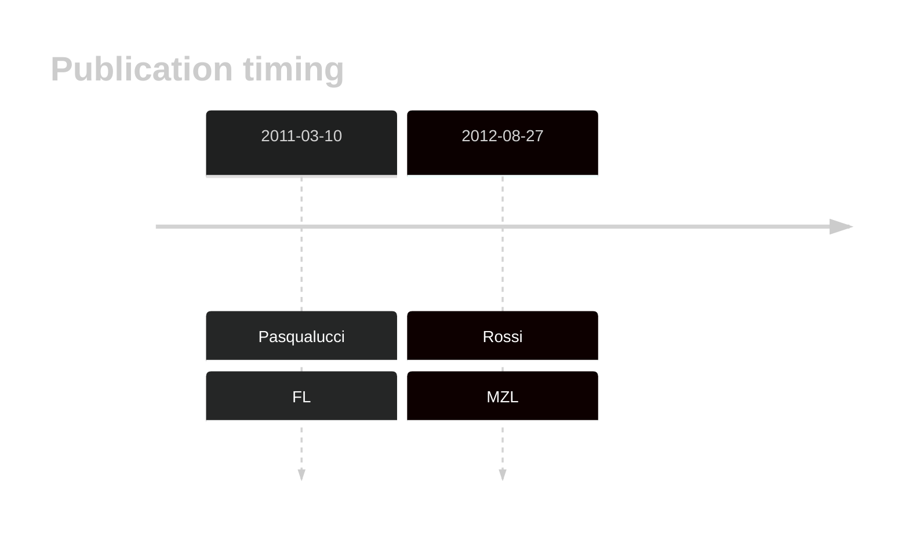

# EP300

## Overview
Mutations in EP300 are significant contributors to the pathogenesis and progression of B-cell lymphomas such as DLBCL and FL. These mutations impair histone acetylation, disrupt epigenetic gene regulation. This gene has some recurrent sites of mutations (hot spots), which typically impact its HAT domain, a region crucial for acetylating histones and non-histone proteins.1,2 Studies using genome-wide CRISPR-Cas9 screens have identified synthetic lethal interactions between CREBBP and EP300, suggesting that targeting one may affect the viability of cells with mutations in the other.3 

## History

## Relevance tier by entity

|Entity|Tier|Description                           |
|:------:|:----:|--------------------------------------|
||1|high-confidence MZL gene|
|    |2   |relevance in BL not firmly established|
| |1   |high-confidence DLBCL gene            |
|    |1   |high-confidence FL gene               |

## Mutation incidence in large patient cohorts (GAMBL reanalysis)

|Entity|source               |frequency (%)|
|:------:|:---------------------:|:-------------:|
|BL    |GAMBL genomes+capture| 4.62        |
|BL    |Thomas cohort        | 4.20        |
|BL    |Panea cohort         | 7.90        |
|DLBCL |GAMBL genomes        |11.85        |
|DLBCL |Schmitz cohort       | 9.79        |
|DLBCL |Reddy cohort         | 7.11        |
|DLBCL |Chapuy cohort        | 8.12        |
|FL    |GAMBL genomes        |12.47        |

## Mutation pattern and selective pressure estimates

|Entity|aSHM|Significant selection|dN/dS (missense)|dN/dS (nonsense)|
|:------:|:----:|:---------------------:|:----------------:|:----------------:|
|BL    |No  |No                   | 2.769          |3.550           |
|DLBCL |No  |No                   | 3.344          |7.980           |
|FL    |No  |Yes                  |15.586          |7.719           |

## EP300 Hotspots

| Chromosome |Coordinate (hg19) | ref>alt | HGVSp | 
 | :---:| :---: | :--: | :---: |
|chr22|41566459|T>C|Y1446H|
|chr22|41566460|A>G|Y1446C|
|chr22|41566460|A>C|Y1446S|
|chr22|41566462|A>T|I1447F|
|chr22|41566466|T>G|F1448C|
|chr22|41566474|C>T|H1451Y|
|chr22|41566476|T>G|H1451Q|
|chr22|41566478 | C>T | P1452L |
|chr22|41566486|C>G|Q1455E|
|chr22|41566487|A>G|Q1455R|
|chr22|41566488|G>T|Q1455H|
|chr22|41566495|C>T|P1458S|
|chr22|41566495|C>A|P1458T|
|chr22|41566496|C>T|P1458L|
|chr22|41566511|T>C|L1463P|
|chr22|41566511|T>G|L1463R|
|chr22|41566519|T>G|W1466G|
|chr22|41566519|T>A|W1466R|
|chr22|41566519|T>C|W1466R|
|chr22|41566520|G>T|W1466L|
|chr22|41566521|G>C|W1466C|
|chr22| 41566522 | T>A | Y1467N |
|chr22| 41566522 | T>C | Y1467H |
|chr22| 41566522 | T>G | Y1467D |
|chr22| 41566523 | A>G | Y1467C |
|chr22| 41566523 | A>T | Y1467F |

View coding variants in ProteinPaint [hg19](https://morinlab.github.io/LLMPP/GAMBL/EP300_protein.html)  or [hg38](https://morinlab.github.io/LLMPP/GAMBL/EP300_protein_hg38.html)

View all variants in GenomePaint [hg19](https://morinlab.github.io/LLMPP/GAMBL/EP300.html)  or [hg38](https://morinlab.github.io/LLMPP/GAMBL/EP300_hg38.html)

## EP300 Expression

## References
1. *Pasqualucci, L., Dominguez-Sola, D., Chiarenza, A., Fabbri, G., Grunn, A., Trifonov, V., Kasper, L., Lerach, S., Tang, H., Ma, J., Rossi, D., Chadburn, A., Murty, V., Mullighan, C., Gaidano, G., Rabadán, R., Brindle, P., & Dalla-Favera, R. (2010). Inactivating mutations of acetyltransferase genes in B-cell lymphoma. Nature, 471, 189 - 195. https://doi.org/10.1038/nature09730.*

2. *Cerchietti, L., Hatzi, K., Caldas-Lopes, E., Yang, S., Figueroa, M., Morin, R., Hirst, M., Mendez, L., Shaknovich, R., Cole, P., Bhalla, K., Gascoyne, R., Marra, M., Chiosis, G., & Melnick, A. (2010). BCL6 repression of EP300 in human diffuse large B cell lymphoma cells provides a basis for rational combinatorial therapy.. The Journal of clinical investigation, 120 12, 4569-82 . https://doi.org/10.1172/JCI42869.* 

3. *Nie M, Du L, Ren W, Joung J, Ye X, Shi X, Ciftci S, Liu D, Wu K, Zhang F, Pan-Hammarström Q. Genome-wide CRISPR screens reveal synthetic lethal interaction between CREBBP and EP300 in diffuse large B-cell lymphoma. Cell Death Dis. 2021 Apr 28;12(5):419. doi: 10.1038/s41419-021-03695-8. PMID: 33911074; PMCID: PMC8080727.*

4. *Morin RD, Mendez-Lago M, Mungall AJ, Goya R, Mungall KL, Corbett RD, Johnson NA, Severson TM, Chiu R, Field M, Jackman S, Krzywinski M, Scott DW, Trinh DL, Tamura-Wells J, Li S, Firme MR, Rogic S, Griffith M, Chan S, Yakovenko O, Meyer IM, Zhao EY, Smailus D, Moksa M, Chittaranjan S, Rimsza L, Brooks-Wilson A, Spinelli JJ, Ben-Neriah S, Meissner B, Woolcock B, Boyle M, McDonald H, Tam A, Zhao Y, Delaney A, Zeng T, Tse K, Butterfield Y, Birol I, Holt R, Schein J, Horsman DE, Moore R, Jones SJ, Connors JM, Hirst M, Gascoyne RD, Marra MA. Frequent mutation of histone-modifying genes in non-Hodgkin lymphoma. Nature. 2011 Jul 27;476(7360):298-303. doi: 10.1038/nature10351. PMID: 21796119; PMCID: PMC3210554.*

<!-- ORIGIN: 21390126 -->
<!-- FL: pasqualucciInactivatingMutationsAcetyltransferase2011a -->
<!-- BL: 2 -->
<!-- MZL: rossiCodingGenomeSplenic2012c -->
<!-- DLBCL: pasqualucciInactivatingMutationsAcetyltransferase2011a -->
