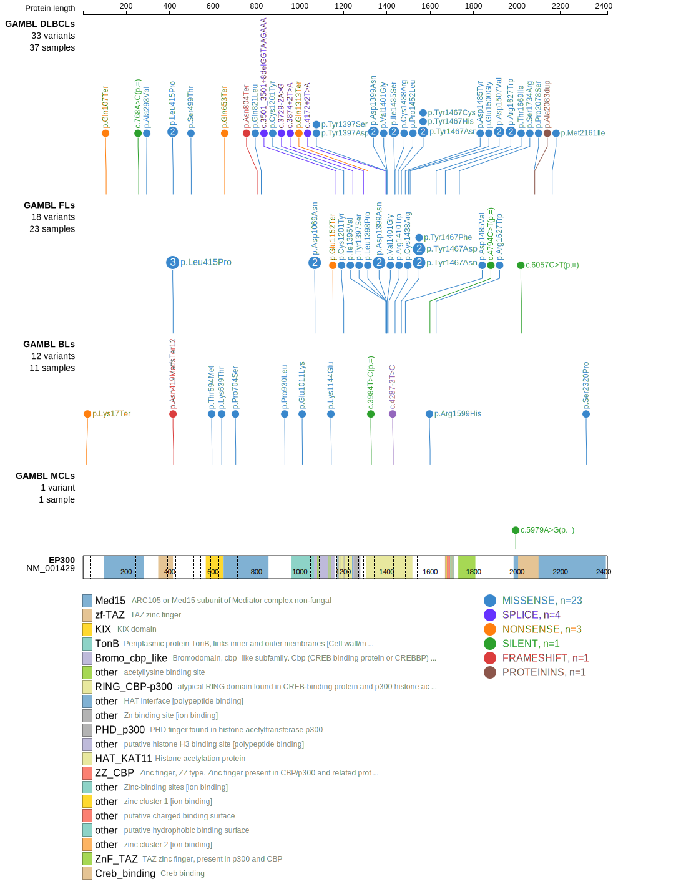

# EP300

## Relevance tier by entity

|Entity|Tier|Description                           |
|:------:|:----:|--------------------------------------|
|BL    |2   |relevance in BL not firmly established|
|DLBCL |1   |high-confidence DLBCL gene            |
|FL    |1   |high-confidence FL gene               |

## Mutation incidence in large patient cohorts (GAMBL reanalysis)

|Entity|source               |frequency (%)|
|:------:|:---------------------:|:-------------:|
|BL    |GAMBL genomes+capture| 4.62        |
|BL    |Thomas cohort        | 4.20        |
|BL    |Panea cohort         | 7.90        |
|DLBCL |GAMBL genomes        |11.85        |
|DLBCL |Schmitz cohort       | 9.79        |
|DLBCL |Reddy cohort         | 7.11        |
|DLBCL |Chapuy cohort        | 8.12        |
|FL    |GAMBL genomes        |12.47        |

## Mutation pattern and selective pressure estimates

|Entity|aSHM|Significant selection|dN/dS (missense)|dN/dS (nonsense)|
|:------:|:----:|:---------------------:|:----------------:|:----------------:|
|BL    |No  |No                   | 2.769          |3.550           |
|DLBCL |No  |No                   | 3.344          |7.980           |
|FL    |No  |Yes                  |15.586          |7.719           |

> [!NOTE]
> First described in DLBCL in 2011 by [Pasqualucci L](https://pubmed.ncbi.nlm.nih.gov/21390126). First described in FL in 2011 by [Morin RD](https://pubmed.ncbi.nlm.nih.gov/21796119)

 ## EP300 Hotspots

| Chromosome |Coordinate (hg19) | ref>alt | HGVSp | 
 | :---:| :---: | :--: | :---: |
| chr22 | 41566478 | C>T | P1452L |
| chr22 | 41566522 | T>A | Y1467N |
| chr22 | 41566522 | T>C | Y1467H |
| chr22 | 41566522 | T>G | Y1467D |
| chr22 | 41566523 | A>G | Y1467C |
| chr22 | 41566523 | A>T | Y1467F |

View coding variants in ProteinPaint [hg19](https://morinlab.github.io/LLMPP/GAMBL/EP300_protein.html)  or [hg38](https://morinlab.github.io/LLMPP/GAMBL/EP300_protein_hg38.html)

View all variants in GenomePaint [hg19](https://morinlab.github.io/LLMPP/GAMBL/EP300.html)  or [hg38](https://morinlab.github.io/LLMPP/GAMBL/EP300_hg38.html)

