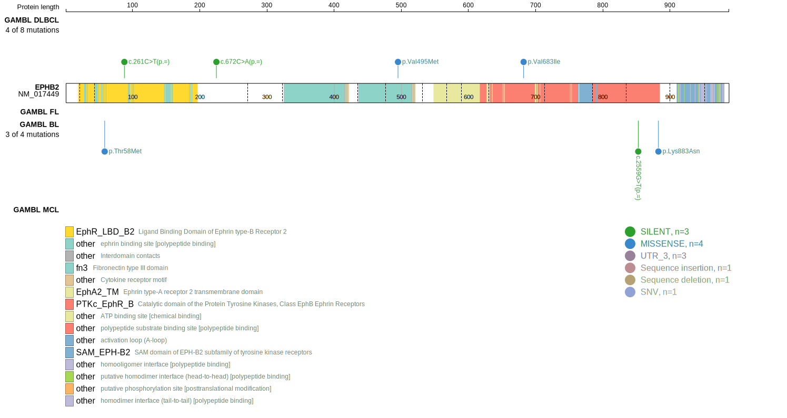
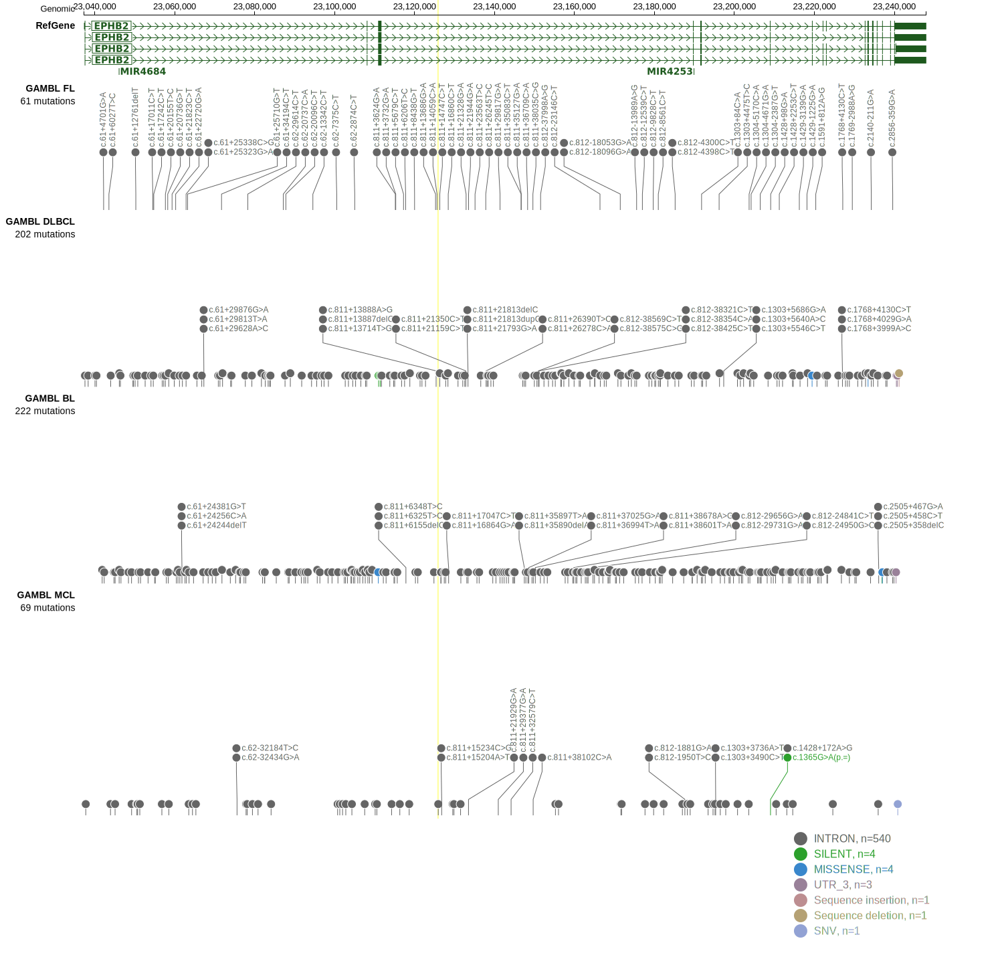

[[_TOC_]]

<<Warn("The variants reported in this gene failed QC")>>

## Relevance tier by entity

|Entity|Tier|Description                           |
|:------:|:----:|--------------------------------------|
|    |3   |Retired, Failed QC[@loveGeneticLandscapeMutations2012]|

## Mutation incidence in large patient cohorts (GAMBL reanalysis)

|Entity|source               |frequency (%)|
|:------:|:---------------------:|:-------------:|
|BL    |GAMBL genomes+capture|1.85         |
|BL    |Thomas cohort        |  NA         |
|BL    |Panea cohort         |  NA         |

## Mutation pattern and selective pressure estimates

[[include:dnds_EPHB2.md]]

View coding variants in ProteinPaint [hg19](https://morinlab.github.io/LLMPP/GAMBL/EPHB2_protein.html)  or [hg38](https://morinlab.github.io/LLMPP/GAMBL/EPHB2_protein_hg38.html)

View all variants in GenomePaint [hg19](https://morinlab.github.io/LLMPP/GAMBL/EPHB2.html)  or [hg38](https://morinlab.github.io/LLMPP/GAMBL/EPHB2_hg38.html)

## EPHB2 Expression

<!-- ORIGIN: loveGeneticLandscapeMutations2012 -->
<!-- BL: loveGeneticLandscapeMutations2012 -->

## Representative Mutations

**Rating**
&starf; &starf; &starf; &star; &star;

**Rating**
&starf; &star; &star; &star; &star;

## All Mutations

[1093](https://www.bcgsc.ca/downloads/morinlab/GAMBL/Love/1093_reports.html)
[513](https://www.bcgsc.ca/downloads/morinlab/GAMBL/Love/513_reports.html)
[516](https://www.bcgsc.ca/downloads/morinlab/GAMBL/Love/516_reports.html)
[676](https://www.bcgsc.ca/downloads/morinlab/GAMBL/Love/676_reports.html)

[[include:mermaid_EPHB2.md]]

## References
