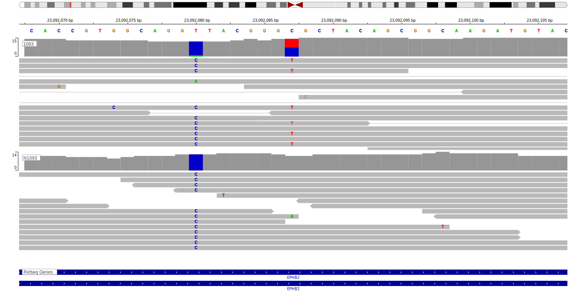

[[_TOC_]]

## Relevance tier by entity

[[include:table1_EPHB2]]

## Warnings

<<Warn("The variants reported in this gene failed QC")>>

## Mutation incidence in large patient cohorts (GAMBL reanalysis)

### BL
[[include:tables/BL_EPHB2.md]]

## Mutation pattern and selective pressure estimates

[[include:tables/dnds_EPHB2.md]]

[[include:browser_EPHB2.md]]

## Expression

<!-- ORIGIN: loveGeneticLandscapeMutations2012 -->
<!-- BL: loveGeneticLandscapeMutations2012 -->

## Representative Mutations

**Rating**
&starf; &starf; &starf; &star; &star;

**Rating**
&starf; &star; &star; &star; &star;

## All Mutations

[1093](https://www.bcgsc.ca/downloads/morinlab/GAMBL/Love/1093_reports.html)
[513](https://www.bcgsc.ca/downloads/morinlab/GAMBL/Love/513_reports.html)
[516](https://www.bcgsc.ca/downloads/morinlab/GAMBL/Love/516_reports.html)
[676](https://www.bcgsc.ca/downloads/morinlab/GAMBL/Love/676_reports.html)

[[include:tables/mermaid_EPHB2.md]]

## References
