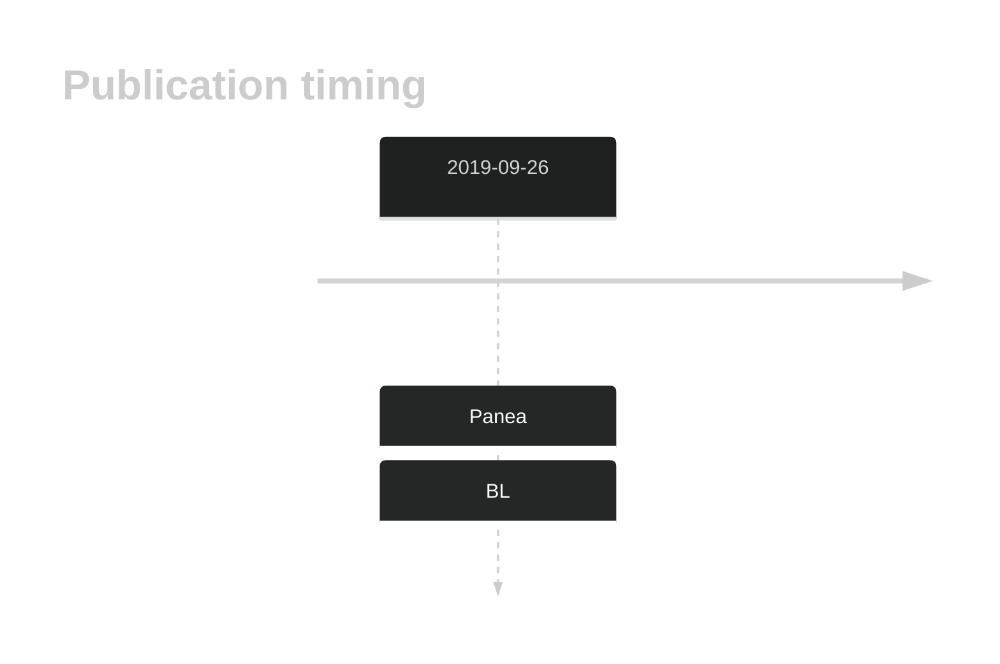
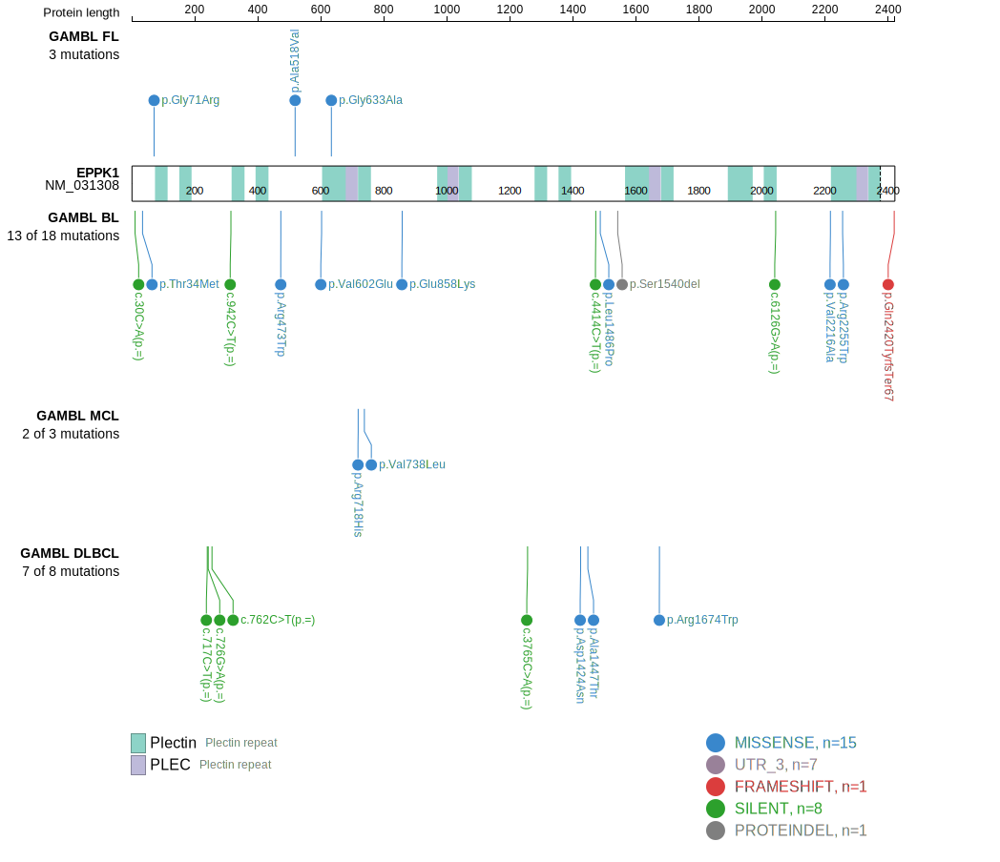
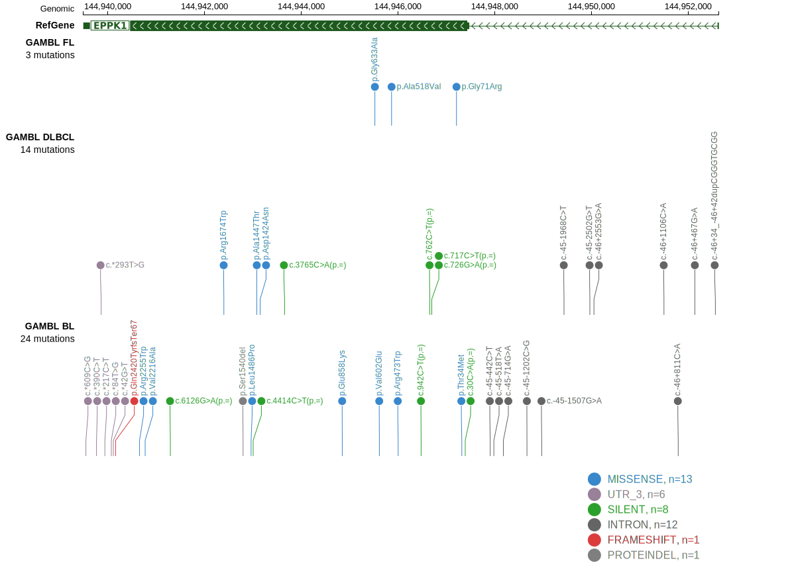

# EPPK1

## History

## Relevance tier by entity

|Entity|Tier|Description            |
|:------:|:----:|-----------------------|
|    |1   |high-confidence BL gene|

## Mutation incidence in large patient cohorts (GAMBL reanalysis)

|Entity|source               |frequency (%)|
|:------:|:---------------------:|:-------------:|
|BL    |GAMBL genomes+capture| 6.47        |
|BL    |Thomas cohort        | 7.60        |
|BL    |Panea cohort         |15.80        |

## Mutation pattern and selective pressure estimates

|Entity|aSHM|Significant selection|dN/dS (missense)|dN/dS (nonsense)|
|:------:|:----:|:---------------------:|:----------------:|:----------------:|
|BL    |No  |No                   |1.066           |0.0             |
|DLBCL |No  |No                   |1.164           |7.7             |
|FL    |No  |No                   |2.802           |0.0             |

 ## EPPK1 Hotspots

| Chromosome |Coordinate (hg19) | ref>alt | HGVSp | 
 | :---:| :---: | :--: | :---: |
| chr8 | 144946005 | G>A | R473W |

View coding variants in ProteinPaint [hg19](https://morinlab.github.io/LLMPP/GAMBL/EPPK1_protein.html)  or [hg38](https://morinlab.github.io/LLMPP/GAMBL/EPPK1_protein_hg38.html)

View all variants in GenomePaint [hg19](https://morinlab.github.io/LLMPP/GAMBL/EPPK1.html)  or [hg38](https://morinlab.github.io/LLMPP/GAMBL/EPPK1_hg38.html)

## EPPK1 Expression

<!-- ORIGIN: paneaWholeGenomeLandscape2019 -->
<!-- BL: paneaWholeGenomeLandscape2019 -->

## References
1.  Panea R, Love C, Shingleton JR, Reddy A, Bailey J, Moormann A, Otieno J, Ong’echa J, Oduor C, Schroêder K, Masalu N, Chao N, Agajanian M, Major M, Fedoriw Y, Richards K, Rymkiewicz G, Miles R, Alobeid B, Bhagat G, Flowers C, Ondrejka S, Hsi E, Choi W, Au-Yeung R, Hartmann W, Lenz G, Meyerson H, Lin YY, Zhuang Y, Luftig M, Waldrop A, Dave T, Thakkar D, Sahay H, Li G, Palus B, Seshadri V, Kim S, Gascoyne R, Levy S, Mukhopadhyay M, Dunson D, Dave S. The whole genome landscape of Burkitt lymphoma subtypes. Blood. 2019; 
