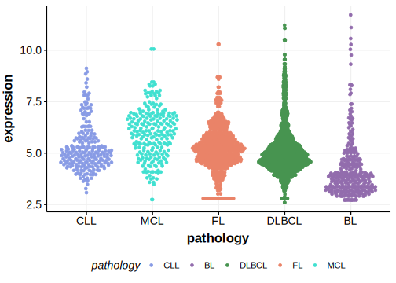

[[_TOC_]]

## Relevance tier by entity

|Entity|Tier|Description            |
|:------:|:----:|-----------------------|
|    |2   |low-confidence BL gene[@paneaWholeGenomeLandscape2019]|

## Mutation incidence in large patient cohorts (GAMBL reanalysis)

|Entity|source               |frequency (%)|
|:------:|:---------------------:|:-------------:|
|BL    |GAMBL genomes+capture| 6.47        |
|BL    |Thomas cohort        | 7.60        |
|BL    |Panea cohort         |15.80        |

## Mutation pattern and selective pressure estimates

[[include:dnds_EPPK1.md]]

## EPPK1 Hotspots

| Chromosome |Coordinate (hg19) | ref>alt | HGVSp | 
 | :---:| :---: | :--: | :---: |
| chr8 | 144946005 | G>A | R473W |

[[include:browser_EPPK1.md]]

## Expression

<!-- ORIGIN: paneaWholeGenomeLandscape2019 -->
<!-- BL: paneaWholeGenomeLandscape2019 -->

[[include:mermaid_EPPK1.md]]

## References
