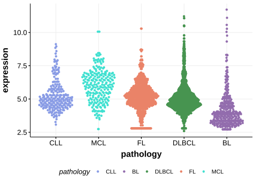

[[_TOC_]]

## Relevance tier by entity

[[include:tables/table1_EPPK1.md]]

## Mutation incidence in large patient cohorts (GAMBL reanalysis)

### BL
[[include:tables/BL_EPPK1.md]]

### DLBCL
[[include:tables/DLBCL_EPPK1.md]]

### FL
[[include:tables/FL_EPPK1.md]]

## Mutation pattern and selective pressure estimates

[[include:tables/dnds_EPPK1.md]]

## EPPK1 Hotspots

| Chromosome |Coordinate (hg19) | ref>alt | HGVSp | 
 | :---:| :---: | :--: | :---: |
| chr8 | 144946005 | G>A | R473W |

[[include:tables/browser_EPPK1.md]]

## Expression

<!-- ORIGIN: paneaWholeGenomeLandscape2019 -->
<!-- BL: paneaWholeGenomeLandscape2019 -->

[[include:tables/mermaid_EPPK1.md]]

## References
