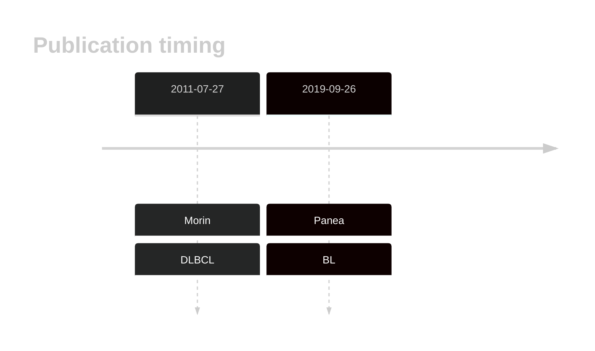
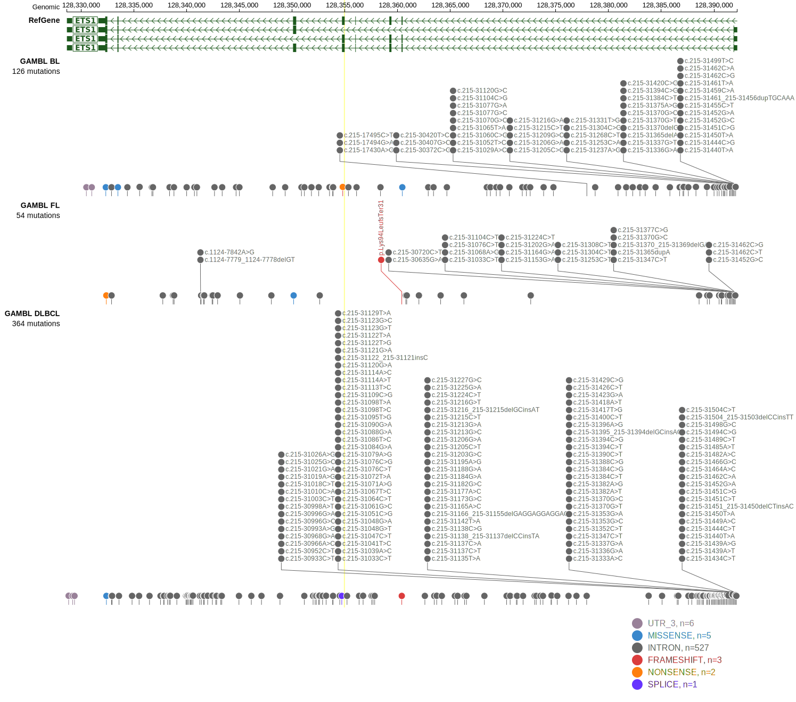

# ETS1

## Overview
ETS1 is one of [a number of genes](https://github.com/morinlab/LLMPP/wiki/ashm) affected by aberrant somatic hypermutation in B-cell lymphomas, which complicates the interpretation of mutations at this locus. This gene has some recurrent sites of mutations (hot spots). The mutation pattern in DLBCL implies the preferential accumulation of *inactivating mutations*.
## History

## Relevance tier by entity

|Entity|Tier|Description                           |
|:------:|:----:|--------------------------------------|
||1|high-confidence PMBL/cHL/GZL gene|
| |1-a | aSHM target and high-confidence DLBCL gene            |
|    |2-a | aSHM target; Although recurrent, the relevance of mutations in BL is tenuous |

## Mutation incidence in large patient cohorts (GAMBL reanalysis)

|Entity|source               |frequency (%)|
|:------:|:---------------------:|:-------------:|
|DLBCL |GAMBL genomes        | 4.59        |
|DLBCL |Schmitz cohort       | 7.87        |
|DLBCL |Reddy cohort         | 4.40        |
|DLBCL |Chapuy cohort        | 5.56        |
|BL    |GAMBL genomes+capture| 7.62        |
|BL    |Thomas cohort        | 7.60        |
|BL    |Panea cohort         |11.90        |

## Mutation pattern and selective pressure estimates

|Entity|aSHM|Significant selection|dN/dS (missense)|dN/dS (nonsense)|
|:------:|:----:|:---------------------:|:----------------:|:----------------:|
|DLBCL |Yes |No                   |2.987           | 0.000          |
|FL    |Yes |No                   |5.163           |25.463          |
|BL    |Yes |No                   |5.097           |18.417          |

## aSHM regions

|chr_name|hg19_start|hg19_end |region                                                                                         |regulatory_comment|
|:--------:|:----------:|:---------:|:-----------------------------------------------------------------------------------------------:|:------------------:|
|chr11   |128339774 |128345731|[intron](https://genome.ucsc.edu/s/rdmorin/GAMBL%20hg19?position=chr11%3A128339774%2D128345731)|enhancer          |
|chr11   |128388492 |128394163|[TSS-2](https://genome.ucsc.edu/s/rdmorin/GAMBL%20hg19?position=chr11%3A128388492%2D128394163) |active_promoter   |

## ETS1 Hotspots

| Chromosome |Coordinate (hg19) | ref>alt | HGVSp | 
 | :---:| :---: | :--: | :---: |
| chr11 | 128391889 | T>A | M1? |
| chr11 | 128391888 | A>C | M1? |
| chr11 | 128391871 | G>A | L7F |
| chr11 | 128391867 | T>C | K8R |
| chr11 | 128391865 | GC>CT | P9A |
| chr11 | 128391865 | G>C | P9A |
| chr11 | 128391865 | G>A | P9S |
| chr11 | 128391861 | G>A | T10I |
| chr11 | 128391859 | G>C | L11V |
| chr11 | 128391855 | G>C | T12S |
| chr11 | 128391855 | G>A | T12I |
| chr11 | 128391853 | T>C | I13V |
| chr11 | 128391853 | T>A | I13F |
| chr11 | 128391848 | G>C | I14M |
| chr11 | 128391846 | T>C | K15R |
| chr11 | 128391841 | C>G | E17Q |
| chr11 | 128391841 | C>A | E17* |
| chr11 | 128391824 | C>G | E22D |
| chr11 | 128391823 | G>A | L23F |

View coding variants in ProteinPaint [hg19](https://morinlab.github.io/LLMPP/GAMBL/ETS1_protein.html)  or [hg38](https://morinlab.github.io/LLMPP/GAMBL/ETS1_protein_hg38.html)

View all variants in GenomePaint [hg19](https://morinlab.github.io/LLMPP/GAMBL/ETS1.html)  or [hg38](https://morinlab.github.io/LLMPP/GAMBL/ETS1_hg38.html)

## ETS1 Expression

## References
1. *Morin RD, Mendez-Lago M, Mungall AJ, Goya R, Mungall KL, Corbett RD, Johnson NA, Severson TM, Chiu R, Field M, Jackman S, Krzywinski M, Scott DW, Trinh DL, Tamura-Wells J, Li S, Firme MR, Rogic S, Griffith M, Chan S, Yakovenko O, Meyer IM, Zhao EY, Smailus D, Moksa M, Chittaranjan S, Rimsza L, Brooks-Wilson A, Spinelli JJ, Ben-Neriah S, Meissner B, Woolcock B, Boyle M, McDonald H, Tam A, Zhao Y, Delaney A, Zeng T, Tse K, Butterfield Y, Birol I, Holt R, Schein J, Horsman DE, Moore R, Jones SJ, Connors JM, Hirst M, Gascoyne RD, Marra MA. Frequent mutation of histone-modifying genes in non-Hodgkin lymphoma. Nature. 2011 Jul 27;476(7360):298-303. doi: 10.1038/nature10351. PMID: 21796119; PMCID: PMC3210554.*

<!-- ORIGIN: morinFrequentMutationHistonemodifying2011 -->
<!-- BL: paneaWholeGenomeLandscape2019 -->
<!-- DLBCL: morinFrequentMutationHistonemodifying2011 -->
