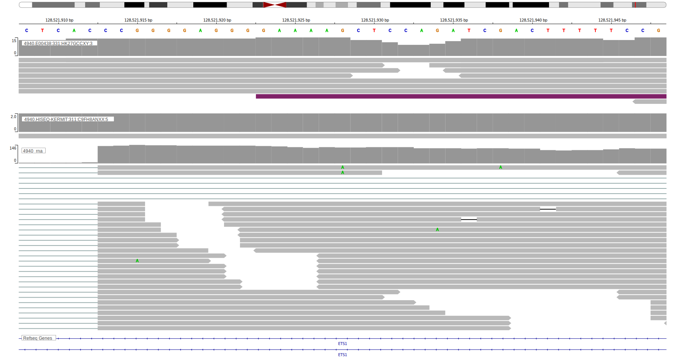

[[_TOC_]]

## Overview

ETS1 is one of [a number of genes](https://github.com/morinlab/LLMPP/wiki/ashm) affected by aberrant somatic hypermutation in B-cell lymphomas, which complicates the interpretation of mutations at this locus. 
This gene has some recurrent sites of mutations (hot spots). 
The mutation pattern in DLBCL implies the preferential accumulation of *inactivating mutations*.

<<Warn("The variants reported in this gene in BL failed QC")>>

## Relevance tier by entity

|Entity|Tier|Description                           |
|:------:|:----:|--------------------------------------|
||1|high-confidence PMBL/cHL/GZL gene|
| |1 | aSHM target and high-confidence DLBCL gene            [@morinFrequentMutationHistonemodifying2011]|
|    |3 | Retired, Failed QC[@paneaWholeGenomeLandscape2019]|

## Mutation incidence in large patient cohorts (GAMBL reanalysis)

[[include:DLBCL_ETS1.md]]
[[include:FL_ETS1.md]]

## Mutation pattern and selective pressure estimates

[[include:dnds_ETS1.md]]

## aSHM regions

|chr_name|hg19_start|hg19_end |region                                                                                         |regulatory_comment|
|:--------:|:----------:|:---------:|:-----------------------------------------------------------------------------------------------:|:------------------:|
|chr11   |128339774 |128345731|[intron](https://genome.ucsc.edu/s/rdmorin/GAMBL%20hg19?position=chr11%3A128339774%2D128345731)|enhancer          |
|chr11   |128388492 |128394163|[TSS-2](https://genome.ucsc.edu/s/rdmorin/GAMBL%20hg19?position=chr11%3A128388492%2D128394163) |active_promoter   |

## ETS1 Hotspots

| Chromosome |Coordinate (hg19) | ref>alt | HGVSp | 
 | :---:| :---: | :--: | :---: |
| chr11 | 128391889 | T>A | M1? |
| chr11 | 128391888 | A>C | M1? |
| chr11 | 128391871 | G>A | L7F |
| chr11 | 128391867 | T>C | K8R |
| chr11 | 128391865 | GC>CT | P9A |
| chr11 | 128391865 | G>C | P9A |
| chr11 | 128391865 | G>A | P9S |
| chr11 | 128391861 | G>A | T10I |
| chr11 | 128391859 | G>C | L11V |
| chr11 | 128391855 | G>C | T12S |
| chr11 | 128391855 | G>A | T12I |
| chr11 | 128391853 | T>C | I13V |
| chr11 | 128391853 | T>A | I13F |
| chr11 | 128391848 | G>C | I14M |
| chr11 | 128391846 | T>C | K15R |
| chr11 | 128391841 | C>G | E17Q |
| chr11 | 128391841 | C>A | E17* |
| chr11 | 128391824 | C>G | E22D |
| chr11 | 128391823 | G>A | L23F |

[[include:browser_ETS1.md]]

## Expression

## Representative Mutations

### BL2

**Rating**
&starf; &star; &star; &star; &star;

**Rating**
&starf; &star; &star; &star; &star;

[[include:mermaid_ETS1.md]]

## References

<!-- ORIGIN: morinFrequentMutationHistonemodifying2011 -->
<!-- BL: paneaWholeGenomeLandscape2019 -->
<!-- DLBCL: morinFrequentMutationHistonemodifying2011 -->
