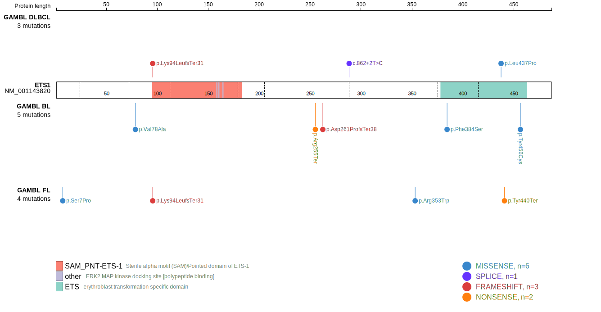

# [ETS1]

## Mutation tier

|Entity|Tier|Description                           |
|:------:|:----:|--------------------------------------|
|BL    |2   |relevance in BL not firmly established|
|DLBCL |1   |high-confidence DLBCL gene            |
## Mutation incidence

|Entity|source               |frequency (%)|
|:------:|:---------------------:|:-------------:|
|BL    |GAMBL genomes+capture| 7.62        |
|BL    |Thomas cohort        | 7.60        |
|BL    |Panea cohort         |11.90        |
|DLBCL |GAMBL genomes        | 4.59        |
|DLBCL |Schmitz cohort       | 7.90        |
|DLBCL |Reddy cohort         | 4.40        |
|DLBCL |Chapuy cohort        | 5.60        |

## Mutation pattern

|Entity|aSHM|Significant selection|dN/dS (missense)|dN/dS (nonsense)|
|:------:|:----:|:---------------------:|:----------------:|:----------------:|
|BL    |Yes |No                   |5.097           |18.417          |
|DLBCL |Yes |No                   |2.987           | 0.000          |
|FL    |Yes |No                   |5.163           |25.463          |

## aSHM regions

|chr_name|hg19_start|hg19_end |region                                                                                         |regulatory_comment|
|:--------:|:----------:|:---------:|:-----------------------------------------------------------------------------------------------:|:------------------:|
|chr11   |128339774 |128345731|[intron](https://genome.ucsc.edu/s/rdmorin/GAMBL%20hg19?position=chr11%3A128339774%2D128345731)|enhancer          |
|chr11   |128388492 |128394163|[TSS-2](https://genome.ucsc.edu/s/rdmorin/GAMBL%20hg19?position=chr11%3A128388492%2D128394163) |active_promoter   |

> [!NOTE]
> First described in BL in 2019 by [Panea RI](https://pubmed.ncbi.nlm.nih.gov/31558468). First described in DLBCL in 2011 by [Morin RD](https://pubmed.ncbi.nlm.nih.gov/21796119)

View coding variants in ProteinPaint [hg19](https://www.bcgsc.ca/downloads/morinlab/GAMBL/test/genes/ETS1_protein.html)  or [hg38](https://www.bcgsc.ca/downloads/morinlab/GAMBL/test/genes/ETS1_protein_hg38.html)

View all variants in GenomePaint [hg19](https://www.bcgsc.ca/downloads/morinlab/GAMBL/test/genes/ETS1.html)

