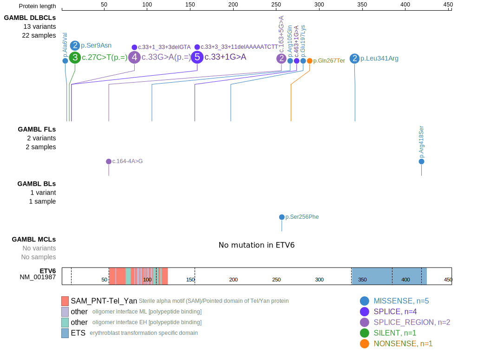
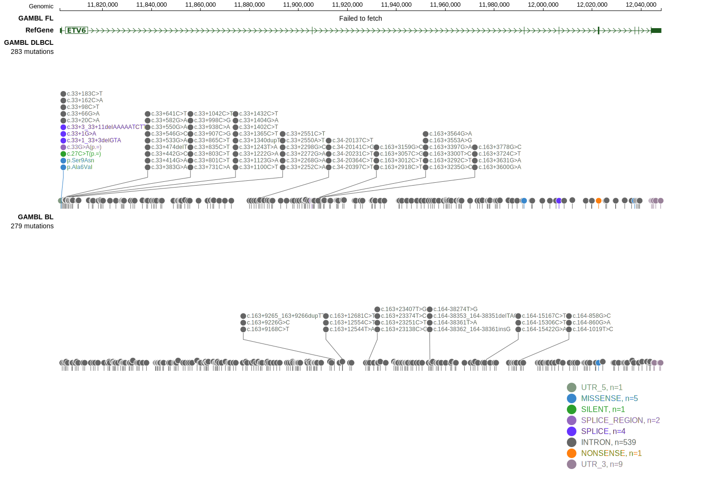

ETV6 is one of [a number of genes](https://github.com/morinlab/LLMPP/wiki/ashm) affected by aberrant somatic hypermutation in B-cell lymphomas, which complicates the interpretation of mutations at this locus.

## Mutation tier

|Entity|Tier|Description               |
|:------:|:----:|--------------------------|
|DLBCL |1   |high-confidence DLBCL gene|
## Mutation incidence

|Entity|source        |frequency (%)|
|:------:|:--------------:|:-------------:|
|DLBCL |GAMBL genomes | 4.97        |
|DLBCL |Schmitz cohort|10.40        |
|DLBCL |Reddy cohort  | 5.80        |
|DLBCL |Chapuy cohort |10.30        |

## Mutation pattern

|Entity|aSHM|Significant selection|dN/dS (missense)|dN/dS (nonsense)|
|:------:|:----:|:---------------------:|:----------------:|:----------------:|
|BL    |Yes |No                   |1.527           | 0.000          |
|DLBCL |Yes |Yes                  |2.366           |28.723          |
|FL    |Yes |No                   |2.772           | 0.000          |

## aSHM regions

|chr_name|hg19_start|hg19_end|region                                                                                    |regulatory_comment|
|:--------:|:----------:|:--------:|:------------------------------------------------------------------------------------------:|:------------------:|
|chr12   |11796001  |11812968|[TSS](https://genome.ucsc.edu/s/rdmorin/GAMBL%20hg19?position=chr12%3A11796001%2D11812968)|strong_enhancer   |

 ## ETV6 Hotspots

| Chromosome |Coordinate (hg19) | ref>alt | HGVSp | 
 | :---:| :---: | :--: | :---: |
| chr12 | 11803078 | C>T | A6V |
| chr12 | 11803087 | G>A | S9N |
| chr12 | 11803094 | G>A | K11= |

View coding variants in ProteinPaint [hg19](https://www.bcgsc.ca/downloads/morinlab/GAMBL/test/genes/ETV6_protein.html)  or [hg38](https://www.bcgsc.ca/downloads/morinlab/GAMBL/test/genes/ETV6_protein_hg38.html)

View all variants in GenomePaint [hg19](https://www.bcgsc.ca/downloads/morinlab/GAMBL/test/genes/ETV6.html)  or [hg38](https://www.bcgsc.ca/downloads/morinlab/GAMBL/test/genes/ETV6_hg38.html)

