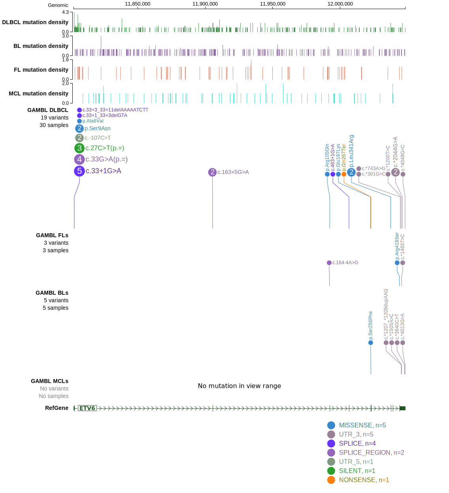

[[_TOC_]]

## Overview
ETV6 is one of [a number of genes](https://github.com/morinlab/LLMPP/wiki/ashm) affected by aberrant somatic hypermutation in B-cell lymphomas, which complicates the interpretation of mutations at this locus. 
The prevalence of mutations in DLBCL has varied across different studies and may occur in as many as 10% of patients. 
This gene has some recurrent sites of mutations (hot spots) including multiple mutations predicted to affect splicing of ETV6 pre-mRNA. 
The mutation pattern in DLBCL mplies the preferential accumulation of *inactivating mutations*. 
Coding and non-coding mutations in this gene are associated with the MCD genetic subgroup of DLBCL. 

## Relevance tier by entity

|Entity|Tier|Description               |
|:------:|:----:|--------------------------|
| |1 | aSHM target and high-confidence DLBCL gene[@lohrDiscoveryPrioritizationSomatic2012; @albuquerqueEnhancingKnowledgeDiscovery2017; @reddyGeneticFunctionalDrivers2017]|

## Mutation incidence in large patient cohorts (GAMBL reanalysis)

[[include:DLBCL_ETV6.md]]

## Mutation pattern and selective pressure estimates

[[include:dnds_ETV6.md]]

## aSHM regions

|chr_name|hg19_start|hg19_end|region                                                                                    |regulatory_comment|
|:--------:|:----------:|:--------:|:------------------------------------------------------------------------------------------:|:------------------:|
|chr12   |11796001  |11812968|[TSS](https://genome.ucsc.edu/s/rdmorin/GAMBL%20hg19?position=chr12%3A11796001%2D11812968)|strong_enhancer   |

## ETV6 Hotspots

| Chromosome |Coordinate (hg19) | ref>alt | HGVSp | 
 | :---:| :---: | :--: | :---: |
| chr12 | 11803078 | C>T | A6V |
| chr12 | 11803087 | G>A | S9N |
| chr12 | 11803094 | G>A | K11= |

View coding variants in ProteinPaint [hg19](https://morinlab.github.io/LLMPP/GAMBL/ETV6_protein.html)  or [hg38](https://morinlab.github.io/LLMPP/GAMBL/ETV6_protein_hg38.html)

View all variants in GenomePaint [hg19](https://morinlab.github.io/LLMPP/GAMBL/ETV6.html)  or [hg38](https://morinlab.github.io/LLMPP/GAMBL/ETV6_hg38.html)

## ETV6 Expression

<!-- ORIGIN: arthurGenomewideDiscoverySomatic2018 -->
<!-- DLBCL: arthurGenomewideDiscoverySomatic2018 -->

[[include:mermaid_ETV6.md]]

## References

