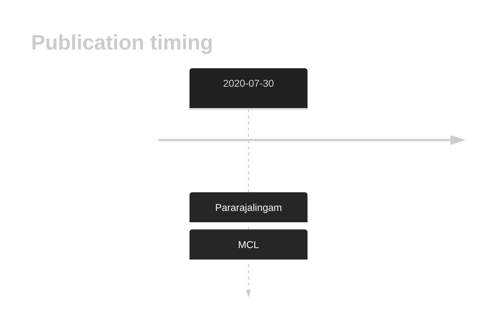
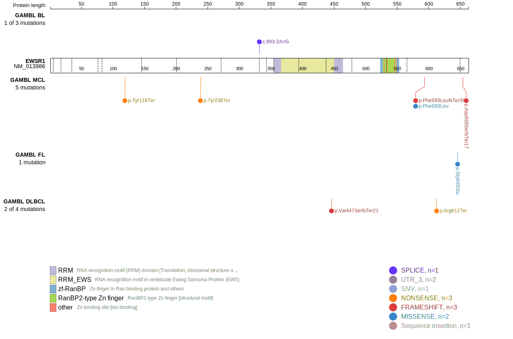
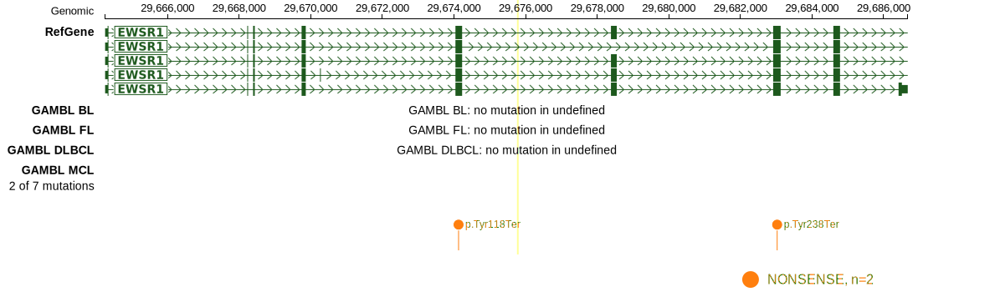
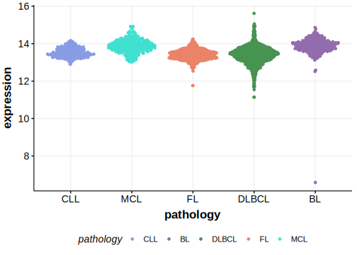

# EWSR1

## Relevance tier by entity

|Entity|Tier|Description             |
|:------:|:----:|------------------------|
||1|high-confidence PMBL/cHL/GZL gene|
|   |1   |high-confidence MCL gene[@pararajalingamCodingNoncodingDrivers2020]|

## Mutation incidence in large patient cohorts (GAMBL reanalysis)

|Entity|source       |frequency (%)|
|:------:|:-------------:|:-------------:|
|MCL   |GAMBL genomes|3.32         |

## Mutation pattern and selective pressure estimates

|Entity|aSHM|Significant selection|dN/dS (missense)|dN/dS (nonsense)|
|:------:|:----:|:---------------------:|:----------------:|:----------------:|
|BL    |No  |No                   |0.000           |9.89            |
|DLBCL |No  |No                   |0.000           |0.00            |
|FL    |No  |No                   |3.052           |0.00            |

View coding variants in ProteinPaint [hg19](https://morinlab.github.io/LLMPP/GAMBL/EWSR1_protein.html)  or [hg38](https://morinlab.github.io/LLMPP/GAMBL/EWSR1_protein_hg38.html)

View all variants in GenomePaint [hg19](https://morinlab.github.io/LLMPP/GAMBL/EWSR1.html)  or [hg38](https://morinlab.github.io/LLMPP/GAMBL/EWSR1_hg38.html)

## EWSR1 Expression

<!-- ORIGIN: pararajalingamCodingNoncodingDrivers2020 -->
<!-- MCL: pararajalingamCodingNoncodingDrivers2020 -->

## References
