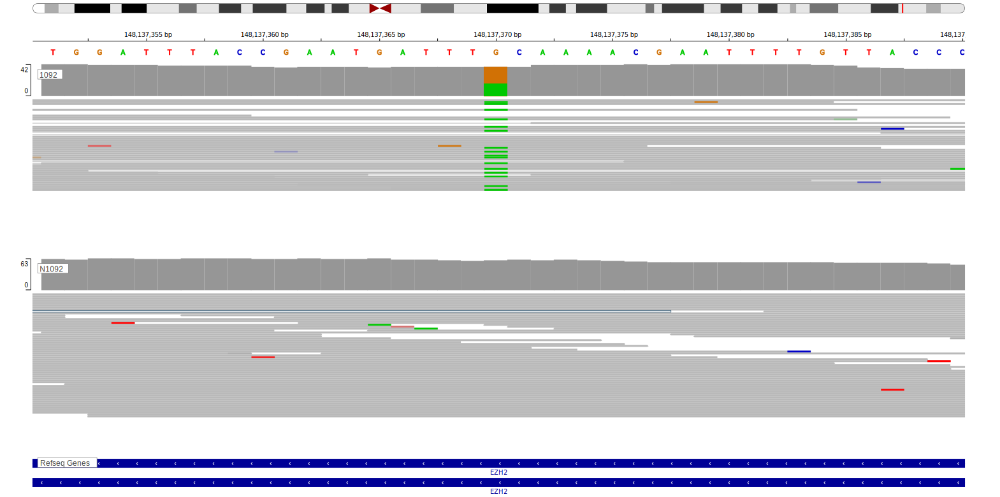

[[_TOC_]]

## Overview
EZH2 encodes a histone methyltransferase that is a component of the polycomb repressive complex 2 (PRC2). 
This gene is recurrently mutated in both FL and DLBCL and has a common mutation hot spot (Y646) that affects the SET domain.[@morinSomaticMutationsAltering2010]
EZH2 mutations are one of the defining features of the EZB genetic subgroup of DLBCL.[@wrightProbabilisticClassificationTool2020] 
Although mutations in EZH2 have been described in some BL patients, they are extremely rare in most BL cohorts that have been sequenced.[@loveGeneticLandscapeMutations2012; @thomasGeneticSubgroupsInform2023] 

## Experimental Evidence

Mutations at the main hotspot and some less common hotspots lead to enhanced methylation by PRC2.[@yapSomaticMutationsEZH22011]
A number of small molecule/pharmacologic inhibitors of EZH2 activity have been described.[@garapaty-raoIdentificationEZH2EZH12013; @knutsonSelectiveInhibitionEZH22014] At least one of these, tazemetostat, has shown benefit in FL.[@morinTreatingLymphomaNow2021] 
Combination therapies including EZH2 inhibitors are also under exploration for DLBCL patients with mutant EZH2.[@scholzeCombinedEZH2Bcl22020]

## Relevance tier by entity

|Entity|Tier|Description                           |
|:------:|:----:|--------------------------------------|
||1|high-confidence MZL gene|
||1|high-confidence PMBL/cHL/GZL gene[@mottokIntegrativeGenomicAnalysis2019]|
| |1   |high-confidence DLBCL gene supported by functional data            [@morinSomaticMutationsAltering2010]|
|    |1   |high-confidence FL gene supported by functional data               [@morinSomaticMutationsAltering2010]|
|    |2   |relevance in BL not firmly established[@loveGeneticLandscapeMutations2012]|

## Mutation incidence in large patient cohorts (GAMBL reanalysis)

[[include:DLBCL_EZH2.md]]
[[include:FL_EZH2.md]]

## Mutation pattern and selective pressure estimates

[[include:dnds_EZH2.md]]

## EZH2 Hotspots

| Chromosome |Coordinate (hg19) | ref>alt | HGVSp | 
 | :---:| :---: | :--: | :---: |
| chr7 | 148508745 | T>C | N640S |
|chr7|148508740|A>G|F642L| 
| chr7 | 148508728 | A>T | Y646N |
| chr7 | 148508728 | A>G | Y646H |
| chr7 | 148508727 | T>G | Y646S |
| chr7 | 148508727 | T>C | Y646C |
| chr7 | 148508727 | T>A | Y646F |
|chr7|148506466|TG>GC|A682G|
|chr7|148506467|G>C|A682G|
|chr7|148506437|GC>AA|A692L|
|chr7|148506437|G>A|A692V|

View coding variants in ProteinPaint [hg19](https://morinlab.github.io/LLMPP/GAMBL/EZH2_protein.html)  or [hg38](https://morinlab.github.io/LLMPP/GAMBL/EZH2_protein_hg38.html)

View all variants in GenomePaint [hg19](https://morinlab.github.io/LLMPP/GAMBL/EZH2.html)  or [hg38](https://morinlab.github.io/LLMPP/GAMBL/EZH2_hg38.html)

## EZH2 Expression

## Representative Mutations

### BL5

**Rating**
&starf; &starf; &starf; &starf; &starf;

## All Mutations

### BL

[1092](https://www.bcgsc.ca/downloads/morinlab/GAMBL/Love/1092_reports.html)
[671](https://www.bcgsc.ca/downloads/morinlab/GAMBL/Love/671_reports.html)
[672](https://www.bcgsc.ca/downloads/morinlab/GAMBL/Love/672_reports.html)
[675](https://www.bcgsc.ca/downloads/morinlab/GAMBL/Love/675_reports.html)

<!-- ORIGIN: morinSomaticMutationsAltering2010 -->
<!-- BL: loveGeneticLandscapeMutations2012 -->
<!-- FL: morinSomaticMutationsAltering2010a -->
<!-- BL: loveGeneticLandscapeMutations2012 -->
<!-- DLBCL: morinSomaticMutationsAltering2010 -->
<!-- PMBL: mottokIntegrativeGenomicAnalysis2019b -->

## History
[[include:mermaid_EZH2.md]]

## References

