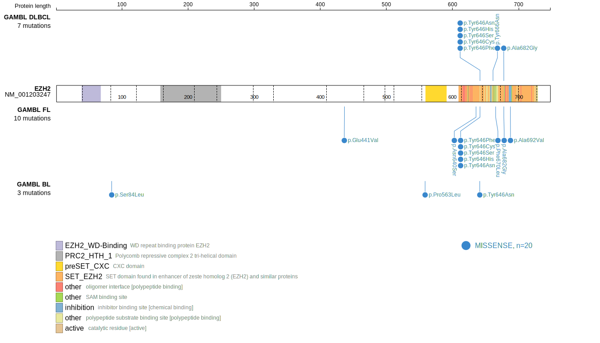
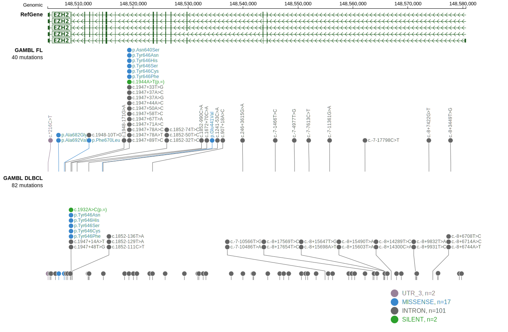

# [EZH2]

## Mutation tier

|Entity|Tier|Description                           |
|:------:|:----:|--------------------------------------|
|BL    |2   |relevance in BL not firmly established|
|DLBCL |1   |high-confidence DLBCL gene            |
|FL    |1   |high-confidence FL gene               |
## Mutation incidence

|Entity|source               |frequency (%)|
|:------:|:---------------------:|:-------------:|
|BL    |GAMBL genomes+capture| 3.46        |
|BL    |Thomas cohort        | 1.30        |
|BL    |Panea cohort         |10.90        |
|DLBCL |GAMBL genomes        |13.77        |
|DLBCL |Schmitz cohort       | 9.10        |
|DLBCL |Reddy cohort         | 8.90        |
|DLBCL |Chapuy cohort        | 5.60        |
|FL    |GAMBL genomes        |24.94        |

## Mutation pattern

|Entity|aSHM|Significant selection|dN/dS (missense)|dN/dS (nonsense)|
|:------:|:----:|:---------------------:|:----------------:|:----------------:|
|BL    |No  |No                   |  4.992         |0               |
|DLBCL |No  |Yes                  | 19.753         |0               |
|FL    |No  |Yes                  |117.987         |0               |

> [!NOTE]
> First described in BL in 2012 by [Love C](https://pubmed.ncbi.nlm.nih.gov/23143597). First described in DLBCL in 2010 by [Morin RD](https://pubmed.ncbi.nlm.nih.gov/20081860). First described in FL in 2010 by [Morin RD](https://pubmed.ncbi.nlm.nih.gov/20081860)

 ## EZH2 Hotspots

| Chromosome |Coordinate (hg19) | ref>alt | HGVSp | 
 | :---:| :---: | :--: | :---: |
| chr7 | 148508745 | T>C | N640S |
| chr7 | 148508728 | A>T | Y646N |
| chr7 | 148508728 | A>G | Y646H |
| chr7 | 148508727 | T>G | Y646S |
| chr7 | 148508727 | T>C | Y646C |
| chr7 | 148508727 | T>A | Y646F |

View coding variants in ProteinPaint [hg19](https://www.bcgsc.ca/downloads/morinlab/GAMBL/test/genes/EZH2_protein.html)  or [hg38](https://www.bcgsc.ca/downloads/morinlab/GAMBL/test/genes/EZH2_protein_hg38.html)

View all variants in GenomePaint [hg19](https://www.bcgsc.ca/downloads/morinlab/GAMBL/test/genes/EZH2.html)  or [hg38](https://www.bcgsc.ca/downloads/morinlab/GAMBL/test/genes/EZH2_hg38.html)

