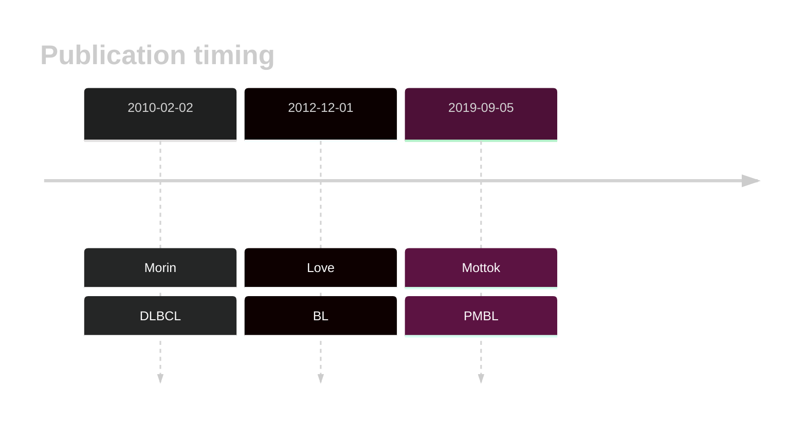
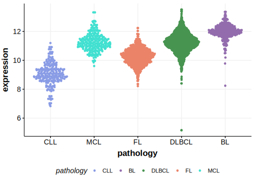

# EZH2

## Overview
EZH2 encodes a histone methyltransferase that is a component of the polycomb repressive complex 2 (PRC2). 
This gene is recurrently mutated in both FL and DLBCL and has a common mutation hot spot (Y646) that affects the SET domain.1 Mutations of this residue and some of the less common hotspots lead to enhanced methylation by PRC2.2,3 
Pharmacologic inhibitors of this activity such as tazemetostat have shown benefit in FL.3 EZH2 mutations are one of the defining features of the EZB genetic subgroup of DLBCL. 
Although mutations in EZH2 have been described in some BL patients, they are extremely rare in most studies.4 

## History

## Relevance tier by entity

|Entity|Tier|Description                           |
|:------:|:----:|--------------------------------------|
||1|high-confidence MZL gene|
||1|high-confidence PMBL/cHL/GZL gene|
| |1   |high-confidence DLBCL gene            |
|    |1   |high-confidence FL gene               |
|    |2   |relevance in BL not firmly established|

## Mutation incidence in large patient cohorts (GAMBL reanalysis)

|Entity|source               |frequency (%)|
|:------:|:---------------------:|:-------------:|
|BL    |GAMBL genomes+capture| 3.46        |
|BL    |Thomas cohort        | 1.30        |
|BL    |Panea cohort         |10.90        |
|DLBCL |GAMBL genomes        |13.77        |
|DLBCL |Schmitz cohort       | 9.15        |
|DLBCL |Reddy cohort         | 8.91        |
|DLBCL |Chapuy cohort        | 5.56        |
|FL    |GAMBL genomes        |24.94        |

## Mutation pattern and selective pressure estimates

|Entity|aSHM|Significant selection|dN/dS (missense)|dN/dS (nonsense)|
|:------:|:----:|:---------------------:|:----------------:|:----------------:|
|BL    |No  |No                   |  4.992         |0               |
|DLBCL |No  |Yes                  | 19.753         |0               |
|FL    |No  |Yes                  |117.987         |0               |

## EZH2 Hotspots

| Chromosome |Coordinate (hg19) | ref>alt | HGVSp | 
 | :---:| :---: | :--: | :---: |
| chr7 | 148508745 | T>C | N640S |
|chr7|148508740|A>G|F642L| 
| chr7 | 148508728 | A>T | Y646N |
| chr7 | 148508728 | A>G | Y646H |
| chr7 | 148508727 | T>G | Y646S |
| chr7 | 148508727 | T>C | Y646C |
| chr7 | 148508727 | T>A | Y646F |
|chr7|148506466|TG>GC|A682G|
|chr7|148506467|G>C|A682G|
|chr7|148506437|GC>AA|A692L|
|chr7|148506437|G>A|A692V|

View coding variants in ProteinPaint [hg19](https://morinlab.github.io/LLMPP/GAMBL/EZH2_protein.html)  or [hg38](https://morinlab.github.io/LLMPP/GAMBL/EZH2_protein_hg38.html)

View all variants in GenomePaint [hg19](https://morinlab.github.io/LLMPP/GAMBL/EZH2.html)  or [hg38](https://morinlab.github.io/LLMPP/GAMBL/EZH2_hg38.html)

## EZH2 Expression

## References

1. *Morin RD, Johnson NA, Severson TM, Mungall AJ, An J, Goya R, Paul JE, Boyle M, Woolcock BW, Kuchenbauer F, Yap D, Humphries RK, Griffith OL, Shah S, Zhu H, Kimbara M, Shashkin P, Charlot JF, Tcherpakov M, Corbett R, Tam A, Varhol R, Smailus D, Moksa M, Zhao Y, Delaney A, Qian H, Birol I, Schein J, Moore R, Holt R, Horsman DE, Connors JM, Jones S, Aparicio S, Hirst M, Gascoyne RD, Marra MA. Somatic mutations altering EZH2 (Tyr641) in follicular and diffuse large B-cell lymphomas of germinal-center origin. Nat Genet. 2010 Feb;42(2):181-5. doi: 10.1038/ng.518. Epub 2010 Jan 17. PMID: 20081860; PMCID: PMC2850970.*
2. *Yap DB, Chu J, Berg T, Schapira M, Cheng SW, Moradian A, Morin RD, Mungall AJ, Meissner B, Boyle M, Marquez VE, Marra MA, Gascoyne RD, Humphries RK, Arrowsmith CH, Morin GB, Aparicio SA. Somatic mutations at EZH2 Y641 act dominantly through a mechanism of selectively altered PRC2 catalytic activity, to increase H3K27 trimethylation. Blood. 2011 Feb 24;117(8):2451-9. doi: 10.1182/blood-2010-11-321208. Epub 2010 Dec 29. PMID: 21190999; PMCID: PMC3062411.*
3. *Morin RD, Arthur SE, Assouline S. Treating lymphoma is now a bit EZ-er. Blood Adv. 2021 Apr 27;5(8):2256-2263. doi: 10.1182/bloodadvances.2020002773. PMID: 33904892; PMCID: PMC8095133.*
4. *Thomas N, Dreval K, Gerhard DS, Hilton LK, Abramson JS, Ambinder RF, Barta S, Bartlett NL, Bethony J, Bhatia K, Bowen J, Bryan AC, Cesarman E, Casper C, Chadburn A, Cruz M, Dittmer DP, Dyer MA, Farinha P, Gastier-Foster JM, Gerrie AS, Grande BM, Greiner T, Griner NB, Gross TG, Harris NL, Irvin JD, Jaffe ES, Henry D, Huppi R, Leal FE, Lee MS, Martin JP, Martin MR, Mbulaiteye SM, Mitsuyasu R, Morris V, Mullighan CG, Mungall AJ, Mungall K, Mutyaba I, Nokta M, Namirembe C, Noy A, Ogwang MD, Omoding A, Orem J, Ott G, Petrello H, Pittaluga S, Phelan JD, Ramos JC, Ratner L, Reynolds SJ, Rubinstein PG, Sissolak G, Slack G, Soudi S, Swerdlow SH, Traverse-Glehen A, Wilson WH, Wong J, Yarchoan R, ZenKlusen JC, Marra MA, Staudt LM, Scott DW, Morin RD. Genetic subgroups inform on pathobiology in adult and pediatric Burkitt lymphoma. Blood. 2023 Feb 23;141(8):904-916. doi: 10.1182/blood.2022016534. PMID: 36201743; PMCID: PMC10023728.*

<!-- ORIGIN: morinSomaticMutationsAltering2010 -->
<!-- BL: loveGeneticLandscapeMutations2012 -->
<!-- FL: morinSomaticMutationsAltering2010a -->
<!-- BL: loveGeneticLandscapeMutations2012 -->
<!-- DLBCL: morinSomaticMutationsAltering2010 -->
<!-- PMBL: mottokIntegrativeGenomicAnalysis2019b -->
