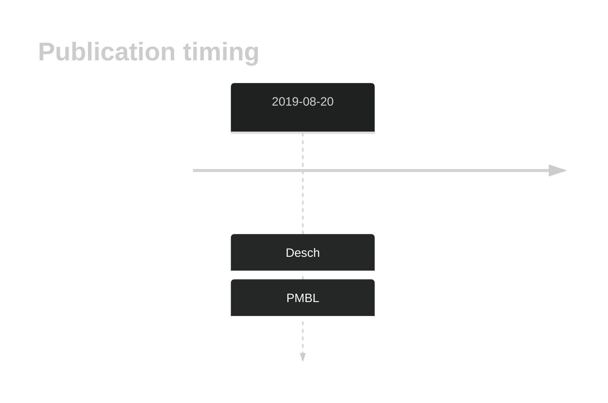
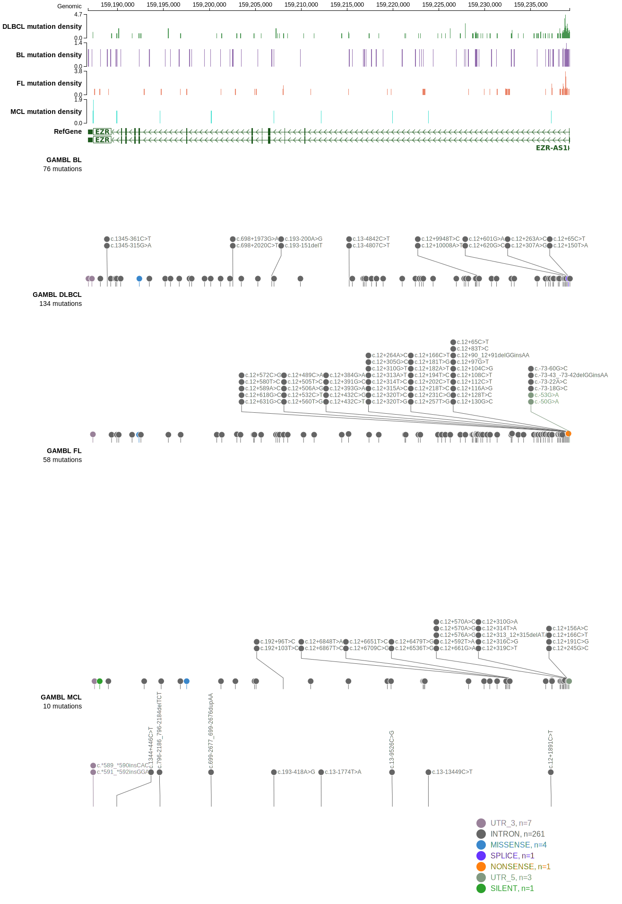

# EZR

## History

## Relevance tier by entity

|Entity|Tier|Description                              |
|:------:|:----:|-----------------------------------------|
||2|relevance in PMBL/cHL/GZL not firmly established|
| |2-a | aSHM target; Although recurrent, the relevance of mutations in DLBCL is tenuous |

## Mutation incidence in large patient cohorts (GAMBL reanalysis)

|Entity|source        |frequency (%)|
|:------:|:--------------:|:-------------:|
|DLBCL |GAMBL genomes |1.34         |
|DLBCL |Schmitz cohort|2.13         |
|DLBCL |Reddy cohort  |1.70         |
|DLBCL |Chapuy cohort |2.56         |

## Mutation pattern and selective pressure estimates

|Entity|aSHM|Significant selection|dN/dS (missense)|dN/dS (nonsense)|
|:------:|:----:|:---------------------:|:----------------:|:----------------:|
|BL    |Yes |No                   |1.425           |16.138          |
|DLBCL |Yes |No                   |2.869           |14.423          |
|FL    |Yes |No                   |3.576           | 0.000          |

## aSHM regions

|chr_name|hg19_start|hg19_end |region                                                                                     |regulatory_comment|
|:--------:|:----------:|:---------:|:-------------------------------------------------------------------------------------------:|:------------------:|
|chr6    |159237903 |159240216|[TSS](https://genome.ucsc.edu/s/rdmorin/GAMBL%20hg19?position=chr6%3A159237903%2D159240216)|NA                |

View coding variants in ProteinPaint [hg19](https://morinlab.github.io/LLMPP/GAMBL/EZR_protein.html)  or [hg38](https://morinlab.github.io/LLMPP/GAMBL/EZR_protein_hg38.html)

View all variants in GenomePaint [hg19](https://morinlab.github.io/LLMPP/GAMBL/EZR.html)  or [hg38](https://morinlab.github.io/LLMPP/GAMBL/EZR_hg38.html)

## EZR Expression

<!-- ORIGIN: deschGenotypingCirculatingTumor2020 -->
<!-- PMBL: deschGenotypingCirculatingTumor2020 -->

## References
1.  Desch AK, Hartung K, Botzen A, Brobeil A, Rummel M, Kurch L, Georgi T, Jox T, Bielack S, Burdach S, Classen CF, Claviez A, Debatin KM, Ebinger M, Eggert A, Faber J, Flotho C, Frühwald M, Graf N, Jorch N, Kontny U, Kramm C, Kulozik A, Kühr J, Sykora KW, Metzler M, Müller HL, Nathrath M, Nüßlein T, Paulussen M, Pekrun A, Reinhardt D, Reinhard H, Rössig C, Sauerbrey A, Schlegel PG, Schneider DT, Scheurlen W, Schweigerer L, Simon T, Suttorp M, Vorwerk P, Schmitz R, Kluge R, Mauz-Körholz C, Körholz D, Gattenlöhner S, Bräuninger A. Genotyping circulating tumor DNA of pediatric Hodgkin lymphoma. Leukemia. 2020 Jan;34(1):151–166. PMID: 31431735
