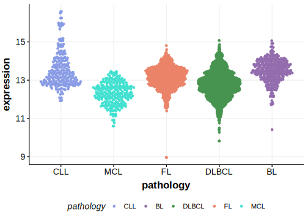

[[_TOC_]]

## Relevance tier by entity

[[include:table1_EZR.md]]

## Mutation incidence in large patient cohorts (GAMBL reanalysis)

|Entity|source        |frequency (%)|
|:------:|:--------------:|:-------------:|
|DLBCL |GAMBL genomes |1.34         |
|DLBCL |Schmitz cohort|2.13         |
|DLBCL |Reddy cohort  |1.70         |
|DLBCL |Chapuy cohort |2.56         |

## Mutation pattern and selective pressure estimates

|Entity|aSHM|Significant selection|dN/dS (missense)|dN/dS (nonsense)|
|:------:|:----:|:---------------------:|:----------------:|:----------------:|
|BL    |Yes |No                   |1.425           |16.138          |
|DLBCL |Yes |No                   |2.869           |14.423          |
|FL    |Yes |No                   |3.576           | 0.000          |

## aSHM regions

|chr_name|hg19_start|hg19_end |region                                                                                     |regulatory_comment|
|:--------:|:----------:|:---------:|:-------------------------------------------------------------------------------------------:|:------------------:|
|chr6    |159237903 |159240216|[TSS](https://genome.ucsc.edu/s/rdmorin/GAMBL%20hg19?position=chr6%3A159237903%2D159240216)|NA                |

[[include:browser_EZR.md]]

## Expression

<!-- ORIGIN: deschGenotypingCirculatingTumor2020 -->
<!-- PMBL: deschGenotypingCirculatingTumor2020 -->

[[include:tables/mermaid_EZR.md]]

## References
