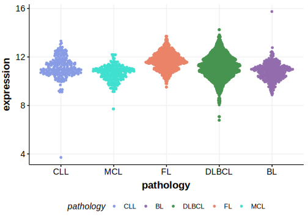

# FAM102A

## Relevance tier by entity

|Entity|Tier|Description                              |
|:------:|:----:|-----------------------------------------|
| |2-a | aSHM target; Although recurrent, the relevance of mutations in DLBCL is tenuous |

## Mutation incidence in large patient cohorts (GAMBL reanalysis)

|Entity|source        |frequency (%)|
|:------:|:--------------:|:-------------:|
|DLBCL |GAMBL genomes |2.49         |
|DLBCL |Schmitz cohort|3.83         |
|DLBCL |Reddy cohort  |2.90         |
|DLBCL |Chapuy cohort |2.14         |

## Mutation pattern and selective pressure estimates

|Entity|aSHM|Significant selection|dN/dS (missense)|dN/dS (nonsense)|
|:------:|:----:|:---------------------:|:----------------:|:----------------:|
|BL    |Yes |No                   | 3.842          |13.756          |
|DLBCL |Yes |No                   | 3.475          | 8.506          |
|FL    |Yes |No                   |10.512          | 0.000          |

## aSHM regions

|chr_name|hg19_start|hg19_end |region                                                                                     |regulatory_comment|
|:--------:|:----------:|:---------:|:-------------------------------------------------------------------------------------------:|:------------------:|
|chr9    |130740362 |130744800|[TSS](https://genome.ucsc.edu/s/rdmorin/GAMBL%20hg19?position=chr9%3A130740362%2D130744800)|NA                |

[[include:browser_FAM102A.md]]

## Expression

<!-- ORIGIN: Unknown -->

## References
