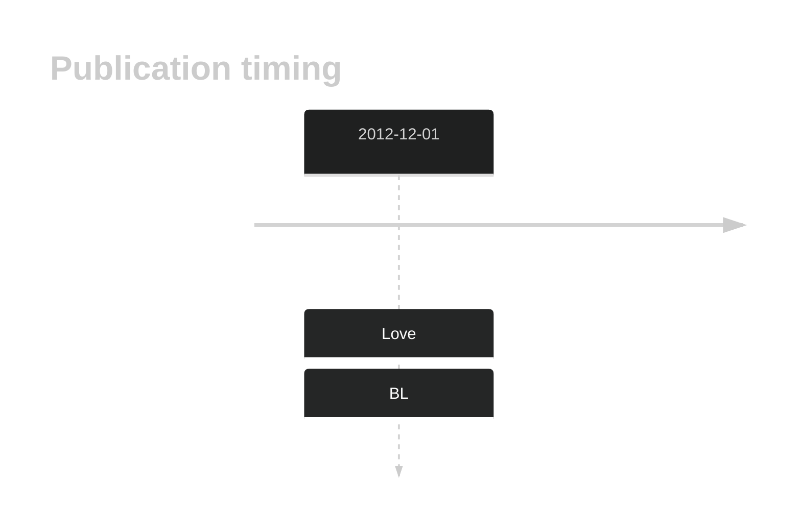

# FAM129B

<<Warn("The variants reported in this gene failed QC")>>

## History

## Relevance tier by entity

|Entity|Tier|Description                           |
|:------:|:----:|--------------------------------------|
|    |2-F   |Failed QC[@loveGeneticLandscapeMutations2012]|

## Mutation incidence in large patient cohorts (GAMBL reanalysis)

|Entity|source               |frequency (%)|
|:------:|:---------------------:|:-------------:|
|BL    |GAMBL genomes+capture|1.39         |
|BL    |Thomas cohort        |  NA         |
|BL    |Panea cohort         |  NA         |

## Mutation pattern and selective pressure estimates

|Entity|aSHM|Significant selection|dN/dS (missense)|dN/dS (nonsense)|
|:------:|:----:|:---------------------:|:----------------:|:----------------:|
|BL    |No  |No                   |0.948           | 0.000          |
|DLBCL |No  |No                   |0.000           |13.541          |
|FL    |No  |No                   |2.483           | 0.000          |

View coding variants in ProteinPaint [hg19](https://morinlab.github.io/LLMPP/GAMBL/FAM129B_protein.html)  or [hg38](https://morinlab.github.io/LLMPP/GAMBL/FAM129B_protein_hg38.html)

View all variants in GenomePaint [hg19](https://morinlab.github.io/LLMPP/GAMBL/FAM129B.html)  or [hg38](https://morinlab.github.io/LLMPP/GAMBL/FAM129B_hg38.html)

<!-- ORIGIN: loveGeneticLandscapeMutations2012 -->
<!-- BL: loveGeneticLandscapeMutations2012 -->

## Representative Mutations

**Rating**
&starf; &starf; &star; &star; &star;

## All Mutations

[1061](https://www.bcgsc.ca/downloads/morinlab/GAMBL/Love/1061_reports.html)
[1063](https://www.bcgsc.ca/downloads/morinlab/GAMBL/Love/1063_reports.html)
[1092](https://www.bcgsc.ca/downloads/morinlab/GAMBL/Love/1092_reports.html)
[475](https://www.bcgsc.ca/downloads/morinlab/GAMBL/Love/475_reports.html)

## References

