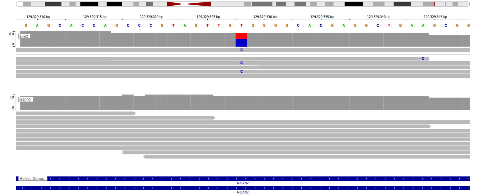

[[_TOC_]]

## Relevance tier by entity

[[include:tables/table1_FAM129B.md]]

## Warnings

<<Warn("The variants reported in this gene failed QC")>>

## Mutation incidence in large patient cohorts (GAMBL reanalysis)

### BL
[[include:tables/BL_FAM129B.md]]

### DLBCL
[[include:tables/DLBCL_FAM129B.md]]

### FL
[[include:tables/FL_FAM129B.md]]

## Mutation pattern and selective pressure estimates

[[include:tables/dnds_FAM129B.md]]

[[include:tables/browser_FAM129B.md]]

## Representative Mutations

**Rating**
&starf; &starf; &star; &star; &star;

## All Mutations

[1061](https://www.bcgsc.ca/downloads/morinlab/GAMBL/Love/1061_reports.html)
[1063](https://www.bcgsc.ca/downloads/morinlab/GAMBL/Love/1063_reports.html)
[1092](https://www.bcgsc.ca/downloads/morinlab/GAMBL/Love/1092_reports.html)
[475](https://www.bcgsc.ca/downloads/morinlab/GAMBL/Love/475_reports.html)

[[include:tables/mermaid_FAM129B.md]]

## References
