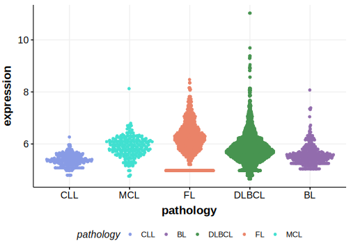

# FANK1

## Relevance tier by entity

|Entity|Tier|Description                              |
|:------:|:----:|-----------------------------------------|
| |2-a | aSHM target; Although recurrent, the relevance of mutations in DLBCL is tenuous |

## Mutation incidence in large patient cohorts (GAMBL reanalysis)

|Entity|source        |frequency (%)|
|:------:|:--------------:|:-------------:|
|DLBCL |GAMBL genomes |0.19         |
|DLBCL |Schmitz cohort|0.64         |
|DLBCL |Reddy cohort  |1.00         |
|DLBCL |Chapuy cohort |0.85         |

## Mutation pattern and selective pressure estimates

|Entity|aSHM|Significant selection|dN/dS (missense)|dN/dS (nonsense)|
|:------:|:----:|:---------------------:|:----------------:|:----------------:|
|BL    |Yes |No                   |1.665           |0               |
|DLBCL |Yes |No                   |1.593           |0               |
|FL    |Yes |No                   |2.933           |0               |

## aSHM regions

|chr_name|hg19_start|hg19_end |region                                                                                      |regulatory_comment|
|:--------:|:----------:|:---------:|:--------------------------------------------------------------------------------------------:|:------------------:|
|chr10   |127578912 |127591133|[TSS](https://genome.ucsc.edu/s/rdmorin/GAMBL%20hg19?position=chr10%3A127578912%2D127591133)|active_promoter   |

[[include:tables/browser_FANK1.md]]

## Expression

<!-- ORIGIN: Unknown -->

## References
