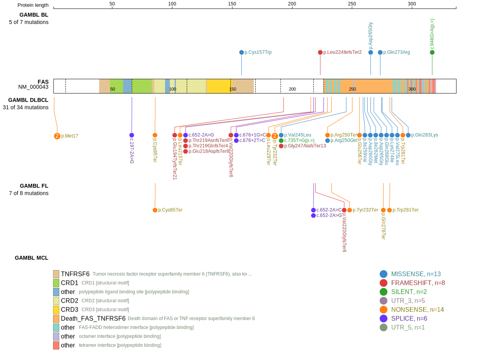
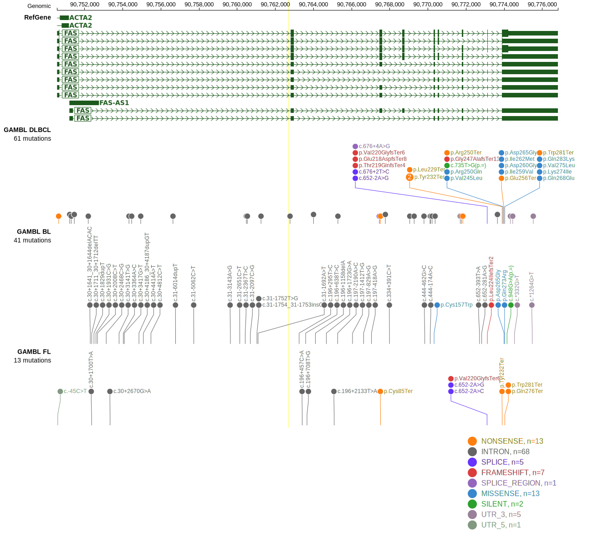
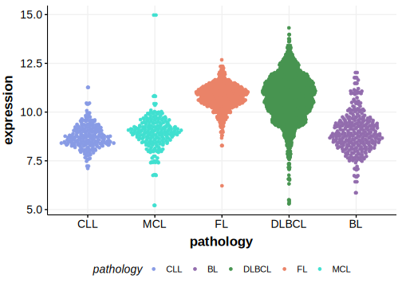

# FAS
## Overview
FAS encodes a cell surface receptor involved in the induction of apoptosis. FAS mutations are common in DLBCL and may be more frequent in primary gastric DLBCL.1,2 Mutations also occur in FL at a lower rate.3 Although reported in one BL study,4 overall the evidence for FAS mutations in BL remains sparse. Mutations in FAS often lead to a loss of function, making lymphoma cells resistant to Fas ligand-induced apoptosis, thereby allowing malignant cells to evade immune surveillance.5 In mouse models, Fas mutations led to a significantly shorter lymphoma-specific survival and reduced sensitivity to chemotherapy.5

## Relevance tier by entity

|Entity|Tier|Description                           |
|:------:|:----:|--------------------------------------|
|DLBCL |1   |high-confidence DLBCL gene            |
|FL    |1   |high-confidence FL gene               |
|BL    |2   |relevance in BL not firmly established|

## Mutation incidence in large patient cohorts (GAMBL reanalysis)

|Entity|source               |frequency (%)|
|:------:|:---------------------:|:-------------:|
|BL    |GAMBL genomes+capture| 2.08        |
|BL    |Thomas cohort        | 1.70        |
|BL    |Panea cohort         | 4.00        |
|DLBCL |GAMBL genomes        | 9.18        |
|DLBCL |Schmitz cohort       |10.85        |
|DLBCL |Reddy cohort         | 4.70        |
|DLBCL |Chapuy cohort        | 8.97        |
|FL    |GAMBL genomes        | 5.08        |

## Mutation pattern and selective pressure estimates

|Entity|aSHM|Significant selection|dN/dS (missense)|dN/dS (nonsense)|
|:------:|:----:|:---------------------:|:----------------:|:----------------:|
|BL    |No  |No                   | 6.699          |  0.000         |
|DLBCL |No  |Yes                  |16.878          |179.289         |
|FL    |No  |Yes                  | 0.000          |176.866         |

View coding variants in ProteinPaint [hg19](https://morinlab.github.io/LLMPP/GAMBL/FAS_protein.html)  or [hg38](https://morinlab.github.io/LLMPP/GAMBL/FAS_protein_hg38.html)

View all variants in GenomePaint [hg19](https://morinlab.github.io/LLMPP/GAMBL/FAS.html)  or [hg38](https://morinlab.github.io/LLMPP/GAMBL/FAS_hg38.html)

## References

1. *Wohlfart, S., Sebinger, D., Gruber, P., Buch, J., Polgar, D., Krupitza, G., Rosner, M., Hengstschläger, M., Raderer, M., Chott, A., & Müllauer, L. (2004). FAS (CD95) mutations are rare in gastric MALT lymphoma but occur more frequently in primary gastric diffuse large B-cell lymphoma.. The American journal of pathology, 164 3, 1081-9 . https://doi.org/10.1016/S0002-9440(10)63195-1.*
2. *Scholl V, Stefanoff CG, Hassan R, Spector N, Renault IZ. Mutations within the 5' region of FAS/CD95 gene in nodal diffuse large B-cell lymphoma. Leuk Lymphoma. 2007 May;48(5):957-63. doi: 10.1080/10428190701230858. PMID: 17487740.*
3. *Morin RD, Mendez-Lago M, Mungall AJ, Goya R, Mungall KL, Corbett RD, Johnson NA, Severson TM, Chiu R, Field M, Jackman S, Krzywinski M, Scott DW, Trinh DL, Tamura-Wells J, Li S, Firme MR, Rogic S, Griffith M, Chan S, Yakovenko O, Meyer IM, Zhao EY, Smailus D, Moksa M, Chittaranjan S, Rimsza L, Brooks-Wilson A, Spinelli JJ, Ben-Neriah S, Meissner B, Woolcock B, Boyle M, McDonald H, Tam A, Zhao Y, Delaney A, Zeng T, Tse K, Butterfield Y, Birol I, Holt R, Schein J, Horsman DE, Moore R, Jones SJ, Connors JM, Hirst M, Gascoyne RD, Marra MA. Frequent mutation of histone-modifying genes in non-Hodgkin lymphoma. Nature. 2011 Jul 27;476(7360):298-303. doi: 10.1038/nature10351. PMID: 21796119; PMCID: PMC3210554.*
4. *Panea RI, Love CL, Shingleton JR, Reddy A, Bailey JA, Moormann AM, Otieno JA, Ong'echa JM, Oduor CI, Schroeder KMS, Masalu N, Chao NJ, Agajanian M, Major MB, Fedoriw Y, Richards KL, Rymkiewicz G, Miles RR, Alobeid B, Bhagat G, Flowers CR, Ondrejka SL, Hsi ED, Choi WWL, Au-Yeung RKH, Hartmann W, Lenz G, Meyerson H, Lin YY, Zhuang Y, Luftig MA, Waldrop A, Dave T, Thakkar D, Sahay H, Li G, Palus BC, Seshadri V, Kim SY, Gascoyne RD, Levy S, Mukhopadyay M, Dunson DB, Dave SS. The whole-genome landscape of Burkitt lymphoma subtypes. Blood. 2019 Nov 7;134(19):1598-1607. doi: 10.1182/blood.2019001880. Erratum in: Blood. 2022 Feb 24;139(8):1256. Erratum in: Blood. 2023 Sep 7;142(10):940. PMID: 31558468; PMCID: PMC6871305.*
5. *Rys, R., Venkataraman, M., Zeng, J., Mann, K., & Johnson, N. (2019). Fas Mutations in Non-Hodgkin's Lymphoma (NHL): Implications for Disease Progression and Therapeutic Resistance. Blood. https://doi.org/10.1182/blood-2019-130602.*
## FAS Expression

<!-- ORIGIN: schollMutationsRegionFAS2007 -->
