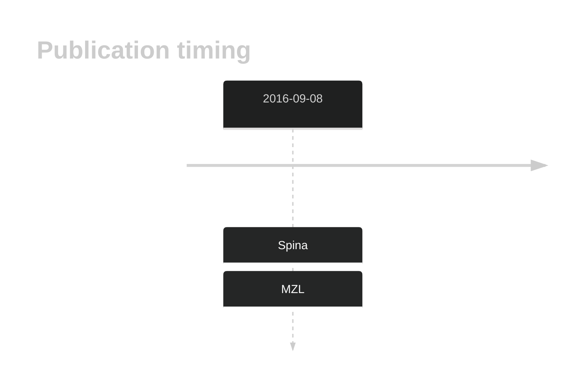

# FAT1

## History

## Relevance tier by entity

|Entity|Tier|Description|
|:------:|:----:|--------------------------------------|
||1|high-confidence MZL gene[@spinaGeneticsNodalMarginal2016]|
||1|high-confidence PMBL/cHL/GZL gene[@]|

## Mutation incidence in large patient cohorts (GAMBL reanalysis)

|Entity|source |frequency (%)|
|:------:|:----:|:----:|
|BL|GAMBL Exome |13.793 |
|BL|GAMBL Genome |7.336 |
|DLBCL|GAMBL Exome |11.59 |
|DLBCL|GAMBL Genome |10.15 |
|FL|GAMBL Exome |6.59 |
|MCL|GAMBL Genome |2.339 |

## References

