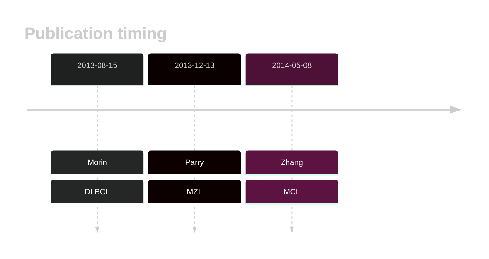

# FAT4

## History

## Relevance tier by entity

|Entity|Tier|Description                              |
|:------:|:----:|-----------------------------------------|
||1|high-confidence PMBL/cHL/GZL gene|
||2|relevance in MZL not firmly established|
| |2   |relevance in DLBCL not firmly established|
|   |2   |relevance in MCL not firmly established  |

## Mutation incidence in large patient cohorts (GAMBL reanalysis)

|Entity|source        |frequency (%)|
|:------:|:--------------:|:-------------:|
|DLBCL |GAMBL genomes |12.81        |
|DLBCL |Schmitz cohort|20.43        |
|DLBCL |Reddy cohort  |14.91        |
|DLBCL |Chapuy cohort |16.67        |
|MCL   |GAMBL genomes | 3.79        |

## Mutation pattern and selective pressure estimates

|Entity|aSHM|Significant selection|dN/dS (missense)|dN/dS (nonsense)|
|:------:|:----:|:---------------------:|:----------------:|:----------------:|
|BL    |No  |No                   |0.000           |0.000           |
|DLBCL |No  |No                   |1.682           |4.189           |
|FL    |No  |No                   |0.000           |0.000           |

View coding variants in ProteinPaint [hg19](https://morinlab.github.io/LLMPP/GAMBL/FAT4_protein.html)  or [hg38](https://morinlab.github.io/LLMPP/GAMBL/FAT4_protein_hg38.html)

View all variants in GenomePaint [hg19](https://morinlab.github.io/LLMPP/GAMBL/FAT4.html)  or [hg38](https://morinlab.github.io/LLMPP/GAMBL/FAT4_hg38.html)

## FAT4 Expression

<!-- ORIGIN: morinMutationalStructuralAnalysis2013 -->
<!-- DLBCL: morinMutationalStructuralAnalysis2013 -->
<!-- MCL: zhangGenomicLandscapeMantle2014 -->
<!-- MZL: parryWholeExomeSequencing2013 -->

## References
1.  Morin RD, Mungall K, Pleasance E, Mungall AJ, Goya R, Huff RD, Scott DW, Ding J, Roth A, Chiu R, Corbett RD, Chan FC, Mendez-Lago M, Trinh DL, Bolger-Munro M, Taylor G, Hadj Khodabakhshi A, Ben-Neriah S, Pon J, Meissner B, Woolcock B, Farnoud N, Rogic S, Lim EL, Johnson NA, Shah S, Jones S, Steidl C, Holt R, Birol I, Moore R, Connors JM, Gascoyne RD, Marra MA. Mutational and structural analysis of diffuse large B-cell lymphoma using whole-genome sequencing. Blood. 2013 Aug 15;122(7):1256–1265. PMCID: PMC3744992
2.  Parry M, Rose-Zerilli MJJ, Gibson J, Ennis S, Walewska R, Forster J, Parker H, Davis Z, Gardiner A, Collins A, Oscier DG, Strefford JC. Whole exome sequencing identifies novel recurrently mutated genes in patients with splenic marginal zone lymphoma. PLoS One. 2013;8(12):e83244. PMCID: PMC3862727
3.  Zhang J, Jima D, Moffitt AB, Liu Q, Czader M, Hsi ED, Fedoriw Y, Dunphy CH, Richards KL, Gill JI, Sun Z, Love C, Scotland P, Lock E, Levy S, Hsu DS, Dunson D, Dave SS. The genomic landscape of mantle cell lymphoma is related to the epigenetically determined chromatin state of normal B cells. Blood. 2014 May 8;123(19):2988–2996. 
